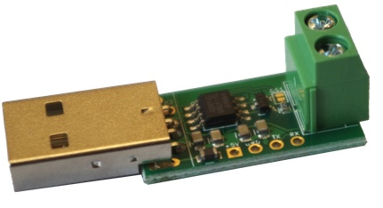
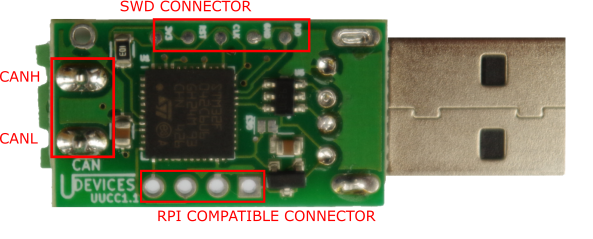

# Usb CAN Converter Basic (UCCB)

https://ucandevices.github.io/




## HW Setup
* USB CAN dongle https://ucandevices.github.io/uccb.html
* `CAN_L` line of the bus (Yellow wire).
* `CAN_H` line of the bus (Green wire)

> To debug tty interface You can use https://github.com/Lukasz-Juranek/interceptty clone ttyACM0 and see what is send on this port.

> As a side note it is better to use gs_usb software for UCCB if You want to use it with socketcan. https://github.com/UsbCANConverter-UCCbasic/UCCB_GS_Embedded/releases

## uCCBViewer

https://github.com/UsbCANConverter-UCCbasic/uCCBViewer/releases/tag/2.5

```bash
cd ~/uccbviewer/
java -jar uCCBViewer-2.5.jar &
```
> Pas réussi à configurer le port (can0, /dev/ttyACM0, ...). Il est possible que le script caninit.sh

## Install

Tested on Ubuntu 16.04LTS (Ubuntu 20.04LTS seems problematic.)


```bash
sudo apt install libsocketcan2
sudo apt install can-utils
sudo apt install wireshark

sudo modprobe can
sudo modprobe can-raw
sudo modprobe slcan

ls -l /dev/tty*
ls -l /dev/ttyACM0
ls -l /dev/ttyS0
lsusb
```

```
Bus 020 Device 006: ID 1d50:606f 1d50 UCCB USB to CAN adapter  Serial: 001D0027564B431320373030
```

## CAN inspection

https://elinux.org/Can-utils

```bash
cansniffer -help
```

```bash
wireshark
```


### Test du dongle USBCAN

Modèle : http://ucandevices.pl/uccb.html

Firmware 9 Sep 2019: https://github.com/UsbCANConverter-UCCbasic/UCCBEmbedded/releases

Depot github https://github.com/UsbCANConverter-UCCbasic


https://github.com/Lukasz-Juranek/ucan_cpp_lib/blob/master/CMakeLists.txt


```bash
pi@picorecell34f0:~/uCCLibC/src $ lsusb
Bus 001 Device 005: ID 1d50:606f OpenMoko, Inc. 
```
https://cateee.net/lkddb/web-lkddb/CAN_GS_USB.html


```bash
git clone https://github.com/UsbCANConverter-UCCbasic/uCCLibC.git
cd uCCLibC
cd src/
g++ -c *.c*
g++ -o demo demo.o rs232.o uCCBlibC.o uCCButil.o
./demo
```


```

/***				   ***/
 *             _____     	     * 
 *            / ____|                * 
 *      _   _| |     __ _ _ __       * 
 *     | | | | |    / _` | '_ \      * 
 *     | |_| | |___| (_| | | | |     * 
 *      \__,_|\_____\__,_|_| |_|     * 
 *                 	DEVICES      * 
 *          			     * 
 *	    C++ lib examples         * 
/***				   ***/


Open command:
O

Close command:
C

Firmware version command:
v

Hardware version command:
V

Serial number command:
N

Status error flag command:
F

Loopback mode command:
l

Listen-only mode command:
L

Baud rate 100k command:
S3

Send standard remote frame (id = 0x1, data length = 8):
r0018

Send extended remote frame (id = 0x1FFFF, data length = 4):
R0001FFFF4

Send standard data frame (id = 0x1, message "canExampleMessage"
hex values: {63 61 6e 45 78 61 6d 70 6c 65 4d 65 73 73 61 67 65}):
t001863616E4578616D70
t00186C654D6573736167
t001165

Send extended data frame (id = 0x1, message "extendedFrame"
hex values: {65 78 74 65 6e 64 65 64 46 72 61 6d 65}):
T000000018657874656E646564
T0000000154672616D65

Set filter for id = 0xFF (filter number and bank number equal 0):
M00007000000FF0000000FF0

illegal comport number
Cannot open port
```
