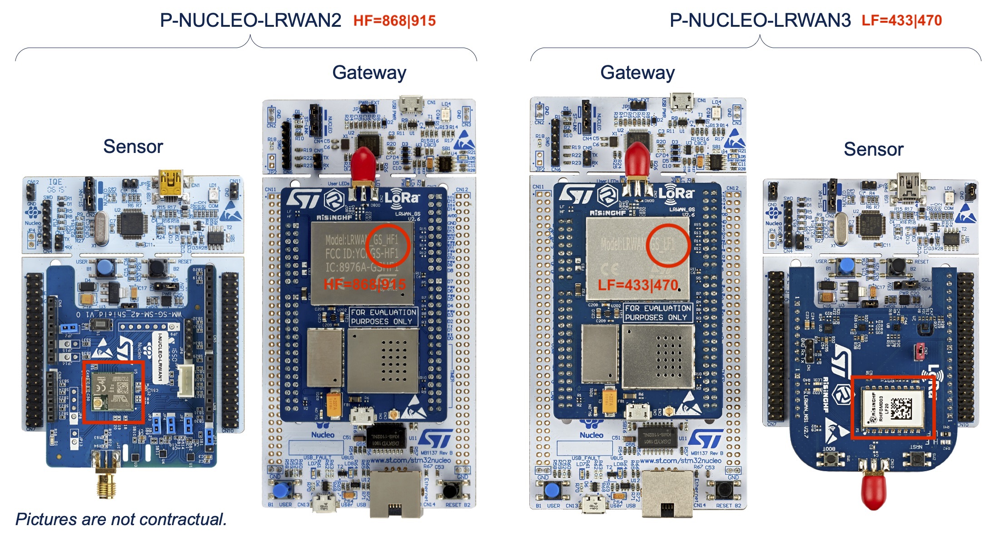

# P-NUCLEO-LRWAN Starter Packs

ST Microelectronics propose 2 Starter Packs de prototypage de la technologie LoRa : [P-NUCLEO-LRWAN2](https://www.st.com/content/st_com/en/products/evaluation-tools/product-evaluation-tools/stm32-nucleo-expansion-boards/p-nucleo-lrwan2.html) et  [P-NUCLEO-LRWAN3](https://www.st.com/en/evaluation-tools/p-nucleo-lrwan3.html). Chaque pack contient une gateway LoRaWAN basée sur une carte Nucleo NUCLEO-F746ZG et un concentrateur LRWAN_GS_HF1 SX1301 de RisingHF (433 MHz et 868 MHz), et un endpoint LoRaWAN basé sur une carte Nucleo NUCLEO-L073RZ et une carte fille comportant un module LoRa (USI pour le 868 MHz et RisingHF pour le 433 MHz).

La gateway LoRaWAN peut être (re)configurée via des commandes AT pour changer:
* le plan de fréquence du SX1301 (ie les 8 channels),
* l'adresse du network server (TTN, Loriot ou CampusIoT) du packet forwarder,
* ...




## Démarrage de la gateway LRWAN2 (868 MHz)

Lisez le [manuel de démarrage](https://www.st.com/content/ccc/resource/technical/document/user_manual/group1/01/0e/9a/df/16/73/42/51/DM00620948/files/DM00620948.pdf/jcr:content/translations/en.DM00620948.pdf).

### Branchements

Branchez l'antenne sur la carte fille LRWAN_GS_HF1. 

Branchez le connecteur micro USB (CN1) de la carte fille LRWAN_GS_HF1 sur un adaptateur 5V.

Branchez le connecteur micro USB (CN1) de la carte Nucleo sur le port USB de votre machine et repérez son port `/dev/tty.*`. Attention: ce port NE SERT PAS à l'alimentation de l'ensemble.

Lancez `minicom -s` sur ce port avec la configuration suivante : `115200 8N1`.


### Enregistrement de la gateway

Entrez les commandes suivantes dans le terminal série pour connaitre l'identifiant du packet forwarder de la gateway :
```
AT+SYS
```

Enregistrez la gateway dans votre organisation.

### Configuration du Network Server

Entrez les commandes suivantes dans le terminal série pour reconfigurer l'adresse du network server:
```
AT+PKTFWD
AT+PKTFWD=lora.campusiot.imag.fr,1700,1700
AT+RESET
```

Vérifiez que la configuration est effective. 
```
+RESET: OK                                                                      
Restarting...                                                                   
                                                                                
    _/_/_/    _/_/_/    _/_/_/  _/_/_/  _/      _/    _/_/_/  _/    _/  _/_/_/  
   _/    _/    _/    _/          _/    _/_/    _/  _/        _/    _/  _/       
  _/_/_/      _/      _/_/      _/    _/  _/  _/  _/  _/_/  _/_/_/_/  _/_/_/    
 _/    _/    _/          _/    _/    _/    _/_/  _/    _/  _/    _/  _/         
_/    _/  _/_/_/  _/_/_/    _/_/_/  _/      _/    _/_/_/  _/    _/  _/          
                                                                                
Powered by RisingHF & STMicroelectronics                                        
------------------------------------------------------------------------------- 
           VERSION: 2.1.7, Nov  6 2018                                          
               LOG: OFF                                                         
           AT ECHO: ON                                                          
          BAUDRATE: 115200bps                                                   
           MACADDR: 00:80:E1:01:52:AF                                           
          ETHERNET: DHCP                                                        
              DNS1: 114.114.114.114                                             
              DNS2: 8.8.8.8                                                     
        NTP SERVER: 1.ubuntu.pool.ntp.org                                       
       EUI PADDING: {3, FF}, {4, FF}                                            
        GATEWAY ID: 0080E1FFFF0152AF                                            
           LORAWAN: Public                                                      
    LORAWAN SERVER: lora.campusiot.imag.fr                                      
   UPLINK UDP PORT: 1700                                                        
 DOWNLINK UDP PORT: 1700                                                        
          CHANNEL0: 867100000, A, SF7/SF12, BW125KHz    (LORA_MULTI_SF)         
          CHANNEL1: 867300000, A, SF7/SF12, BW125KHz    (LORA_MULTI_SF)         
          CHANNEL2: 867500000, A, SF7/SF12, BW125KHz    (LORA_MULTI_SF)         
          CHANNEL3: 867700000, A, SF7/SF12, BW125KHz    (LORA_MULTI_SF)         
          CHANNEL4: 867900000, A, SF7/SF12, BW125KHz    (LORA_MULTI_SF)         
          CHANNEL5: 868100000, B, SF7/SF12, BW125KHz    (LORA_MULTI_SF)         
          CHANNEL6: 868300000, B, SF7/SF12, BW125KHz    (LORA_MULTI_SF)         
          CHANNEL7: 868500000, B, SF7/SF12, BW125KHz    (LORA_MULTI_SF)         
          CHANNEL8: 868300000, B, SF7, BW250KHz         (LORA_STANDARD)         
          CHANNEL9: 868800000, B, 50Kbps                (FSK)                   
------------------------------------------------------------------------------- 
Concentrator starting...                                                        
Concentrator Radio A type SX1257                                                
Concentrator Radio B type SX1257                                                
Concentrator started (2926ms)                                                   
ST LoRa GW V2                                                                   
Ethernet starting...                                                            
Ethernet started                                                                
DHCP IP: 10.0.1.3                                                               
Downlink UDP Connected                                                          
Uplink UDP Connected                                                            
```

Positionnez le mode de journalisation de la gateway.
```
AT+LOG                                                                      
AT+LOG=ON
```


La gateway envoie alors les messages LoRa reçus par le concentrateur RisingHF au network server.

### Configuration du serveur NTP

L'adresse du serveur NTP est pas défaut `1.ubuntu.pool.ntp.org`

La configuration du NTP server peut être requis (c'est le cas à l'Université Grenoble Alpes).

```
AT+NTP                                                                          
+NTP: "1.ubuntu.pool.ntp.org"                                                   
AT+NTP=0.europe.pool.ntp.org                                                    
+NTP: "0.EUROPE.POOL.NTP.ORG"                                                   
AT+SYS
```

Pour l'Université Grenoble Alpes:
```
AT+NTP=195.83.24.250                                                    
AT+SYS
```
### Branchement du GPS
TODO


### Liste des commandes AT

```
AT Returns +OK.
AT+HELP Prints help information.
AT+FDEFAULT Resets to factory default settings.
AT+RESET Software-reset gateway.
AT+SYS Checks all configurations.
AT+VER Gets version.
AT+LOG Turns on/off packet forwarder log.
AT+ECHO AT command echo on/off.
AT+MAC Sets/gets the gateway MAC address.
AT+IP DHCP/static IP control.
AT+DNS Sets/gets the DNS address.
AT+NTP Sets/gets the NTP server address.
AT+EUI MAC Address (EUI48) to Gateway ID (EUI64) padding. LORAWAN LoRaWAN® network selection (public/private).
AT+PKTFWD Packet forwarder server address and port settings.
AT+CH Packet forwarder channels.
AT+Baudrate AT command and logging UART interface baud rate.
```

### Perte ou mise à jour du firmware par défaut

Afin d'éviter une perte du firmware, vous pouvez _dumper_ celui de votre carte avant son usage.

Vous pouvez aussi réinstaller celui-ci mis à disposition par [TTN](https://www.thethingsnetwork.org/docs/gateways/st/).

> Attention: il faudra configurer la gateway avec les commandes AT et notamment la MacAddress avec celui qui est sur l'étiquette présente sous la carte (`AT+MAC=mac_address`).

## Démarrage du kit I-NUCLEO-LRWAN1 (868 MHz)

Le kit [I-NUCLEO-LRWAN1](https://www.st.com/en/evaluation-tools/i-nucleo-lrwan1.html) (carte Nucleo L073RZ et [modem USI LoRa](https://raw.githubusercontent.com/USIWP1Module/USI_I-NUCLEO-LRWAN1/master/WM-SG-SM-42%20AT%20Command%20Reference%20Manual%20rev.2.6_20200225.pdf)) est livré avec un firmware par défaut.

DevEUI, AppEUI et AppKey sont inscrits sur une étiquette sur la face dessous de la carte Nucleo.

Si ce n'est pas ou plus le cas, pour récupérer DevEUI, AppEUI et AppKey, vous pouvez :
* soit observer les frames LoRa de type JoinRequest reçues par votre gateway. Sur le LoRaServer, le joinEUI correspond à l'AppEUI,
* soit brancher un adapteur USBSerial sur les broches de la carte USI retirée de la carte Nucleo.
* soit lire le DevEUI et l'AppEui dans la mémoire Flash de la carte Nucleo

Pour le deuxième cas, le brochage est le suivant:
* +3V3 (CN6 pin 4)
* GND (CN6 pin 6)
* LPUART1_Rx (CN8 pin 2)
* LPUART1_Tx (CN8 pin 1)
et le réglage du port série est : 115200 8N1

Les commandes AT sont les suivantes:
```
AT+EUI
AT+APPEUI
AT+AK
```

Pour le troisième cas, les commandes à lancer sont:
* Pour le DevEUI: `ST-LINK_CLI.exe -c swd ur -r8 0x08080000 0x08`
* Pour l'AppEUI: `ST-LINK_CLI.exe -c swd ur -r8 0x08080008 0x08`

Dans le firmware par défaut, l'AppKey est la concatenation du DevEUI et l'AppEUI.

Vous pouvez alors enregistrer le kit sur votre network server.

Une fois enregistré, le kit effectue l'activation en mode OTAA et envoie périodiquement des frames dont le payload est encodé au [format LPP Cayenne](https://community.mydevices.com/t/cayenne-lpp-2-0/7510). Configurez le décodeur de frames selon le mode LPP Cayenne pour décoder le payload. Le résultat ressemblera à cet objet JSON: 
```
{
  "digitalInput": {
    "3": 0
  },
  "digitalOutput": {
    "4": 0
  },
  "temperatureSensor": {
    "1": 23
  },
  "humiditySensor": {
    "2": 41.5
  },
  "barometer": {
    "0": 990.7
  }
}
```
## Démarrage de la gateway LRWAN3 (433 MHz)

Le démarrage de la gateway LRWAN3 est presque identique au démarrage de la gateway LRWAN2.
Elle est par défaut configurée sur la bande ISM chinoise (cn470). Il convient de reconfigurer ces canaux pour être conforme à la réglementation européene (ETSI eu433).

```
AT+SYS
AT+SYS                                                                       
+SYS: OK                                                                     
-------------------------------------------------------------------------------
           VERSION: 2.1.7, Nov  6 2018  
               LOG: OFF                 
           AT ECHO: ON                  
          BAUDRATE: 115200bps           
           MACADDR: 00:80:E1:01:12:34   
          ETHERNET: DHCP
              DNS1: 114.114.114.114
              DNS2: 8.8.8.8
        NTP SERVER: 1.ubuntu.pool.ntp.org                                       
       EUI PADDING: {3, FF}, {4, FF}                                            
        GATEWAY ID: 0080E1FFFF011234                                            
           LORAWAN: Public                                                      
    LORAWAN SERVER: cn1.loriot.io                                               
   UPLINK UDP PORT: 1780                                                        
 DOWNLINK UDP PORT: 1780                                                        
          CHANNEL0: 471500000, A, SF7/SF12, BW125KHz    (LORA_MULTI_SF)         
          CHANNEL1: 471700000, A, SF7/SF12, BW125KHz    (LORA_MULTI_SF)         
          CHANNEL2: 471900000, A, SF7/SF12, BW125KHz    (LORA_MULTI_SF)         
          CHANNEL3: 472100000, A, SF7/SF12, BW125KHz    (LORA_MULTI_SF)         
          CHANNEL4: 472300000, B, SF7/SF12, BW125KHz    (LORA_MULTI_SF)         
          CHANNEL5: 472500000, B, SF7/SF12, BW125KHz    (LORA_MULTI_SF)         
          CHANNEL6: 472700000, B, SF7/SF12, BW125KHz    (LORA_MULTI_SF)         
          CHANNEL7: 472900000, B, SF7/SF12, BW125KHz    (LORA_MULTI_SF)         
          CHANNEL8: OFF                                 (LORA_STANDARD)         
          CHANNEL9: OFF                                 (FSK)                   
------------------------------------------------------------------------------- 
```

```
AT+PKTFWD=lora.campusiot.imag.fr,1700,1700
AT+LOG=ON                                                                    
AT+CH
AT+CH=eu433                                                                    
AT+RESET
```

La gateway écoute et réponds désormais sur les canaux suivants.
```
+CH: 0, 433175000, A, SF7/SF12, BW125KHz (LORA_MULTI_SF)                        
+CH: 1, 433375000, A, SF7/SF12, BW125KHz (LORA_MULTI_SF)                        
+CH: 2, 433575000, A, SF7/SF12, BW125KHz (LORA_MULTI_SF)                        
+CH: 3, 433775000, A, SF7/SF12, BW125KHz (LORA_MULTI_SF)                        
+CH: 4, 433975000, B, SF7/SF12, BW125KHz (LORA_MULTI_SF)                        
+CH: 5, 434175000, B, SF7/SF12, BW125KHz (LORA_MULTI_SF)                        
+CH: 6, 434375000, B, SF7/SF12, BW125KHz (LORA_MULTI_SF)                        
+CH: 7, 434575000, B, SF7/SF12, BW125KHz (LORA_MULTI_SF)                        
+CH: 8, OFF                              (LORA_STANDARD)                        
+CH: 9, OFF                              (FSK)                                  
```

La gateway peut être enregistrée sur un network server configuré par la bande eu433.

## Démarrage du kit LRWAN_NS1 (433 MHz)

Le kit ST Nucleo LoRa Sensor LRWAN_NS1 est basé sur la carte Nucleo-L073 et la carte fille ST Nucleo LoRa Sensor basé sur le module [RHF0M003](http://www.risinghf.com/#/product-details?product_id=4&lang=en) de RisingHF.

Par défaut, ce kit est par défaut configuré sur la bande ISM chinoise (cn470). Il convient de reconfigurer ses canaux pour être conforme à la réglementation européene (ETSI eu433) conformément à la [documentation](https://www.st.com/resource/en/user_manual/dm00620948-getting-started-with-the-pnucleolrwan2-and-pnucleolrwan3-starter-packs-stmicroelectronics.pdf#page=28):
- soit en reconstruisant le firmware 
- soit en le reconfigurant via les commandes AT

Pour recontruire le firmware avec l'environnement gratuit [STM32CubeIDE](https://www.st.com/en/development-tools/stm32cubeide.html), il faut : 
- télécharger le code de l'[extension LoRaWAN du STM3Cube](https://www.st.com/en/embedded-software/i-cube-lrwan.html)
- importer le projet `STM32CubeExpansion_LRWAN_V1.3.1/Projects/STM32L073RZ-Nucleo/Applications/LoRa/AT_Master/SW4STM32/LRWAN_NS1` de l'environnement [SW4STM32](https://www.st.com/en/development-tools/sw4stm32.html) dans STM32CubeIDE: [guide de migration](https://www.st.com/resource/en/user_manual/dm00613836-migration-guide-from-system-workbench-to-stm32cubeide-stmicroelectronics.pdf)
- modifier le code source de l'application AT_Master `STM32CubeExpansion_LRWAN_V1.3.1/Projects/STM32L073RZ-Nucleo/Applications/LoRa/AT_Master/LoRaWAN/App/src/main.c` comme indiqué dans la [documentation](https://www.st.com/resource/en/user_manual/dm00620948-getting-started-with-the-pnucleolrwan2-and-pnucleolrwan3-starter-packs-stmicroelectronics.pdf#page=28)
```
#main.c

#ifdef USE_LRWAN_NS1
#define FREQ_BAND                  /*EU868*/ CN470PREQUEL <-- à modifier pour EU433
#endif
```
- compiler le projet et flasher le firmware sur le noeud (menu `Run>Run`).  Plus de détails sur https://www.st.com/en/development-tools/stm32cubeide.html#resource

Une fois enregistré, le kit effectue l'activation en mode OTAA et envoie périodiquement des frames dont le payload est encodé au [format LPP Cayenne](https://community.mydevices.com/t/cayenne-lpp-2-0/7510). Configurez le décodeur de frames selon le mode LPP Cayenne pour décoder le payload. Le résultat ressemblera à cet objet JSON: 
```
{
  "digitalInput": {
    "3": 0
  },
  "digitalOutput": {
    "4": 0
  },
  "temperatureSensor": {
    "1": 23
  },
  "humiditySensor": {
    "2": 41.5
  },
  "barometer": {
    "0": 990.7
  }
}
```

## Documentation
* [P-NUCLEO-LRWAN2](https://www.st.com/content/st_com/en/products/evaluation-tools/product-evaluation-tools/stm32-nucleo-expansion-boards/p-nucleo-lrwan2.html)  STM32 Nucleo pack LoRa™ HF band sensor and gateway
* [P-NUCLEO-LRWAN3](https://www.st.com/en/evaluation-tools/p-nucleo-lrwan3.html) STM32 Nucleo pack LoRa™ LF band sensor and gateway
* [manuel de démarrage](https://www.st.com/content/ccc/resource/technical/document/user_manual/group1/01/0e/9a/df/16/73/42/51/DM00620948/files/DM00620948.pdf/jcr:content/translations/en.DM00620948.pdf)
