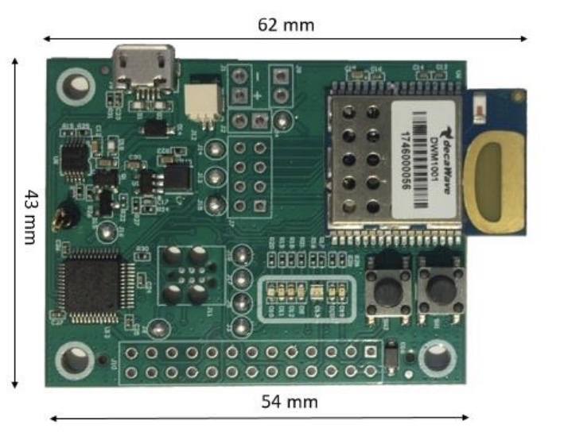
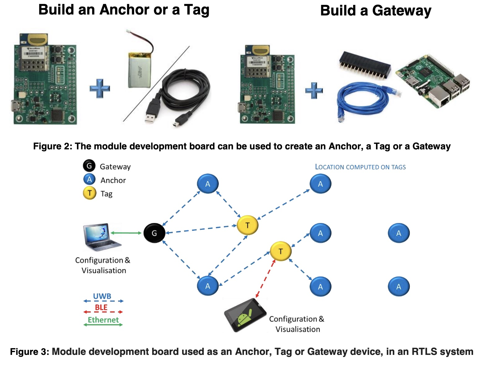

# Qorvo DWM1001

Ultra WideBand (UWB) is one of the technologies for indoor [Real-time locating systems (RTLS)](https://en.wikipedia.org/wiki/Real-time_locating_system) with centimeter accuracy. Ultra WideBand (UWB) measures how long it takes for a radio wave to get from the asset to the anchor or reference point. This is called time of flight (TOF). [more](https://www.pozyx.io/pozyx-academy/how-does-ultra-wideband-work).

Applications of indoor RTLS are : robotics/cobotics, industry 4.0 (smart factory), smart building maintenance, worker safety (danger zone alert), flying drone swarm's indoor positioning, sports, disable persons (Alzeimler), hospital (nursing trolley, stretcher, wheelchair ...) , RC car ...

The Qorvo/Decawave DWM1001 development board includes a DWM1001 module which is based on a Nordic nRF51832 microcontroller. This microcontroller is an ARM Cortex-M4 with 64KB of RAM and 512KB of flash memory. It also provides in integrated BLE radio. The DWM1001 module also contains an Ultra Wide Band transceiver for indoor ranging and geolocation.

https://www.mouser.fr/datasheet/2/412/DWM1001_DEV_Data_Sheet-1950462.pdf





## Getting started

* [DWM1001 Gateway Quick Deployment Guide](https://www.qorvo.com/products/d/da007973)
* [DWM1001 FIRMWARE APPLICATION PROGRAMMING INTERFACE (API) GUIDE](https://www.qorvo.com/products/d/da007975)

## Getting started with RIOT

* https://github.com/RIOT-OS/RIOT/blob/master/boards/dwm1001/doc.txt
* https://github.com/RIOT-OS/RIOT/blob/master/examples/twr_aloha/README.md

```bash
PROGRAMMER=openocd make BOARD=dwm1001 -C examples/hello-world flash
PROGRAMMER=openocd make BOARD=dwm1001 -C examples/twr_aloha flash
```


## Getting started with Zephyr

* https://github.com/RT-LOC/zephyr-dwm1001
* https://github.com/foldedtoad/dwm1001

## Getting started with Apache MyNewT

* https://github.com/Decawave/uwb-core

## Getting started with Arduino

https://github.com/thotro/arduino-dw1000

## Getting started with ROS

* https://forum.qorvo.com/t/robot-localization-using-dwm1001-for-ros-2/11992
* https://github.com/TIERS/ros-dwm1001-uwb-localization
* https://repositorio-aberto.up.pt/bitstream/10216/145742/2/593212.pdf
* https://researchrepository.wvu.edu/cgi/viewcontent.cgi?article=12337&context=etd

## References
* https://www.pozyx.io/pozyx-academy/how-does-ultra-wideband-work
* https://github.com/Decawave
* https://github.com/Decawave/dwm1001-examples
* https://medium.com/garage-inside-garage/getting-started-with-ultra-wide-band-3d-positioning-dwm1000-and-dwm1001-modules-ba2f64e572b6
* https://developer.nordicsemi.com/nRF_Connect_SDK/doc/1.9.1/zephyr/boards/arm/decawave_dwm1001_dev/doc/index.html

### Video
* [MDEK Quick Start Guide](https://www.youtube.com/watch?v=hI8EaU5nOmI) 
* https://www.youtube.com/watch?v=emjC0HYd5gE
* https://www.youtube.com/watch?v=zA27p0Pj30U
* https://www.youtube.com/watch?v=6CNfgOF7ZPk
* [RC Car indoor positionning](https://www.youtube.com/watch?v=-JsLYsDf_n0)
* [Drone outdoor positionning](https://www.youtube.com/watch?v=mVLj2kUZXe0)
* [Drone indoor positionning](https://www.youtube.com/watch?v=7s3HGcX9zEw&t=321s)
* [Drone indoor positionning](https://www.youtube.com/watch?v=FVa_on1S_gg)
   
### PCB
* https://oshwlab.com/iforce2d/dwm1000-pro-mini
