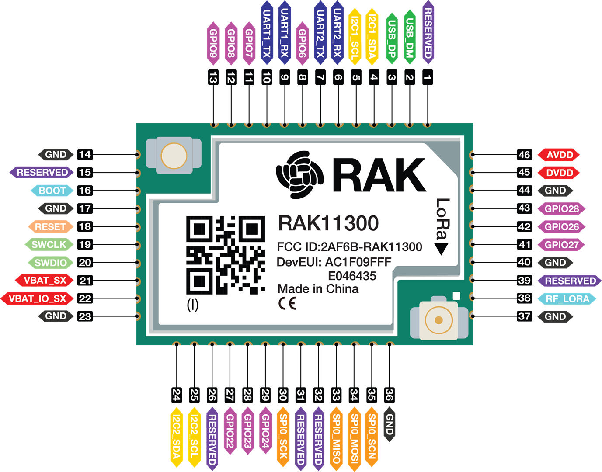
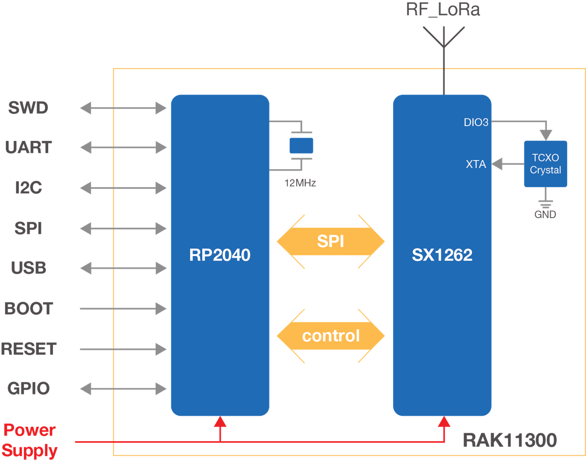

# RAK Wireless RAK11300 / RAK11310

The [RAK11300 WisDuo LPWAN module](https://docs.rakwireless.com/product-categories/wisduo/rak11300-module/overview/) (or [RAK11310](https://docs.rakwireless.com/product-categories/wisblock/rak11310/quickstart/)) is based on the Raspberry Pi RP2040 chip and SX1262 RF transceiver. It provides an easy-to-use, small, low-power solution for long-range wireless data applications. This module complies with LoRaWAN 1.0.2 specifications, Classes A and C. It can easily connect to various LoRaWAN server (public/private) platforms such as TheThingsNetwork (TTN), ChirpStack, and Helium.

* [AT commands](https://docs.rakwireless.com/product-categories/wisduo/rak11300-module/at-command-manual/)
* [Development with Arduino](arduino)
* [Development with PlatformIO]([arduino](https://learn.rakwireless.com/hc/en-us/articles/26687276346775-How-To-Perform-Installation-of-Board-Support-Package-in-PlatformIO?_gl=1*1pebxns*_gcl_au*MTI3NzM5Mzc5My4xNzUyOTk0MDMx))
* [Development with RUI](rui)
* [Development with Meshtastic](meshtastic)

## References
* https://learn.rakwireless.com/hc/en-us/search?utf8=%E2%9C%93&query=RAK11300
* https://learn.rakwireless.com/hc/en-us/articles/26940013861143-How-to-Get-Started-with-RAKwireless-Products
