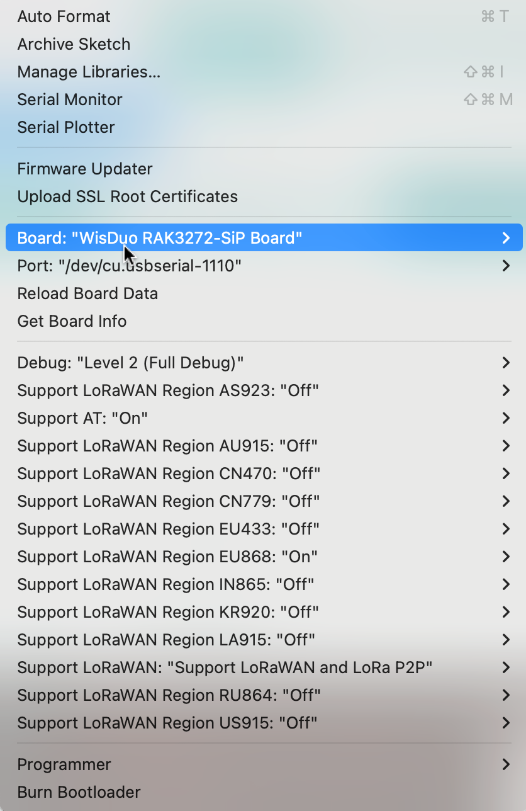

# RAK2270 Sticker Tracker

RAK2270 Sticker Tracker is a battery-powered LoRaWAN tracker with a label-like form factor powered by STM32WLE5. RAK2270 is the WisDuo Module RAK3172-SiP/RAK3172LP-SiP.

Production versions are ready to used on Helium network or private LoRaWAN networks.

* https://github.com/RAKWireless/RAK2270-Sticker-Tracker

The developer version can be controlled using [AT Commands](https://docs.rakwireless.com/product-categories/software-apis-and-libraries/rui3/at-command-manual/) with the default RUI3 firmware.

The firmware of developer version can be customized using [Arduino boards and libraries](https://docs.rakwireless.com/product-categories/software-apis-and-libraries/rui3/supported-ide)

https://docs.rakwireless.com/product-categories/software-apis-and-libraries/rui3/overview/

[RAK2270 Sticker Tracker](https://github.com/RAKWireless/RAK2270-Sticker-Tracker/blob/main/Hardware/Schematic_RAK2270_VD_2024_0731.pdf) includes:
* a SHTC3/NC temperature and humidity sensor,
* a LIS3DH 3-axis accelerometer
* 2 ECC : ATECC608A-SSHDA/NC and ATECC608A-MAHDA/NC
* a AT24CM02-SSHM EEPROM
* a BMX160/NC low power 9-axis sensor that provides precise acceleration and angular rate (gyroscopic) and geomagnetic measurement in each spatial direction.

## Programming probe

Plug the programming probe (2x5 pins) into the USB UART adapter : `3V3` (brown), `GND` (grey), `TXD` (purple), `RXD` (blue)

Then connect the probe the 2x5 pins pad of the RAK2270 Sticker flexible PCB.


## [AT Commands](https://docs.rakwireless.com/product-categories/software-apis-and-libraries/rui3/at-command-manual/)

The default baud rate is `115200`

```bash
tio -L
tio -b 115200 -m INLCRNL /dev/tty.usbserial-xxxx
```


```
AT
AT+VER=?
AT+CLIVER=?
AT+APIVER=?
AT+HWMODEL=?
AT+HWID=?
AT+DEVEUI=?
AT+APPEUI=?
AT+APPKEY=?
AT+ADR=?
AT+CLASS=?
```

```
AT+TTH=868000000:868500000:100000:6
AT+TCONF=868000000:14:4:12:0:0:0:1:16:25000:2:3
AT+TRX=4
```

## Arduino API to RUI3

Read https://docs.rakwireless.com/product-categories/software-apis-and-libraries/rui3/supported-ide


Edit the `Additional Board Manager URLs` into `Preferences` by adding `https://raw.githubusercontent.com/RAKWireless/RAKwireless-Arduino-BSP-Index/main/package_rakwireless.com_rui_index.json`

Install `RAKWireless RUI STM32` Boards (`Tools` Menu > `Boards Manager`).


### LoRaWAN OTAA

Open the sketch `File > Examples > RAK WisBlock RUI examples >  Example > LoRaWAN_OTAA`

Edit the `Band/Region`, `DevEUI`, `AppEUI`, `AppKey` into the sketch and register the device into your LNS:

```c
#define OTAA_BAND     (RAK_REGION_EU868)
#define OTAA_DEVEUI   {0xac, 0x1f, 0x09, 0xff, 0xfe, 0x18, 0xbb, 0x89}
#define OTAA_APPEUI   {0xAC, 0x1F, 0x09, 0xFF, 0xF8, 0x68, 0x22, 0x70}
#define OTAA_APPKEY   { 0xAC, 0x1F, 0x09, 0xFF, 0xFE, 0x18, 0xBB, 0x89, 0xAC, 0x1F, 0x09, 0xFF, 0xF8, 0x68, 0x22, 0x70}
```

Configure the board options into the `Tool` menu.

> Hint: Set the debug to `Level 2 (Full Debug)` and unset unused bands



Load the sketch

Once correctly loaded, open the serial monitor console (baudrate at 115200) then unplug and plug the serial UART adapter

```console
RAKwireless LoRaWan OTAA Example
------------------------------------------------------
Wait for LoRaWAN join...+EVT:JOINED
Duty cycle is ON
Packet is CONFIRMED
Device Address is FC00ACAB
Uplink period is 20000ms

Current Work Mode: LoRaWAN.
Data Packet:
0x74 0x65 0x73 0x74 
Sending is requested
Successfully sent
+EVT:SEND_CONFIRMED_OK
Data Packet:
0x74 0x65 0x73 0x74 
Sending is requested
Successfully sent
+EVT:SEND_CONFIRMED_OK
Data Packet:
0x74 0x65 0x73 0x74 
Sending is requested
Sending failed
+EVT:SEND_CONFIRMED_FAILED(4)
Data Packet:
0x74 0x65 0x73 0x74 
Sending is requested
Sending failed
+EVT:SEND_CONFIRMED_FAILED(4)
Data Packet:
0x74 0x65 0x73 0x74 
Sending is requested
```

Queue a confirmed downlink message into the device console (with port `111` and base64 encoded message `SEVMTE8K` for `HELLO` )

> Hint: Use `echo 'HELLO' | base64` for encoding on base64

After the next uplink, the device receives the downlinl message and display:

```
Data Packet:
0x74 0x65 0x73 0x74 
Sending is requested
Successfully sent
+EVT:SEND_CONFIRMED_OK
+EVT:RX_1:-46:10:UNICAST:111:48454c4c4f0a
Something received!
48454c4c4fa
```

> Remark: `48454c4c4f` + `0a` is `HELLO\n`

### Scan IC2 components 

Open and load the [skech for scanning available I2C components](i2c_scanner/i2c_scanner.ino)

```
Scanning...
I2C device found at address 0x19  !
done
```

> `0x19` is `00011001b`

### Scan IC2 components using 

Install `Adafruit LIS3DH` library using `Tools > Manage Libraries ...`

Open the example `File > Adafruit LIS3DH > acceldemo`

Change the I2C address to `0x19` into to following line: 

```c
  if (! lis.begin(0x19)) {   // change this to 0x19 for alternative i2c address
```

Load then open the serial console.

###  Exercices

Extend the LoRaWAN OTAA example by:

* [ ] adding LinkCheck every 10 uplinks
* [ ] adding library to get temperature (SHTC3/NC)and send them using the LPP format.
* [ ] adding library to get 3-axis acceleration (LIS3DH) and send them using the LPP format.
* [ ] adding library to get the battery level and add it to the LPP message as an analog data channel.


#### Hints

Filling a Cayenne Low Power Payload: 
```c
    int16_t t = 245;
    uint8_t h = 70;
    uint32_t pre = 70;
    uint16_t batt = 3300;

    /** Cayenne Low Power Payload */
    uint8_t data_len = 0;
    collected_data[data_len++] = 0x01;	//Data Channel: 1
    collected_data[data_len++] = 0x67;	//Type: Temperature Sensor
    collected_data[data_len++] = (uint8_t) (t >> 8);
    collected_data[data_len++] = (uint8_t) t;
    collected_data[data_len++] = 0x02;	//Data Channel: 2
    collected_data[data_len++] = 0x68;	//Type: Humidity Sensor
    collected_data[data_len++] = (uint8_t) h;
    collected_data[data_len++] = 0x03;	//Data Channel: 3
    collected_data[data_len++] = 0x73;	//Type: Barometer
    collected_data[data_len++] = (uint8_t) ((pre & 0x0000FF00) >> 8);
    collected_data[data_len++] = (uint8_t) (pre & 0x000000FF);
    collected_data[data_len++] = 0x04;  //Data Channel: 4
    collected_data[data_len++] = 0x02;  //Type: Analog Input
    collected_data[data_len++] = (uint8_t)(batt >> 8);
    collected_data[data_len++] = (uint8_t)batt;
  
    Serial.println("Data Packet:");
    for (int i = 0; i < data_len; i++) {
        Serial.printf("0x%02X ", collected_data[i]);
    }
    Serial.println("");
```
