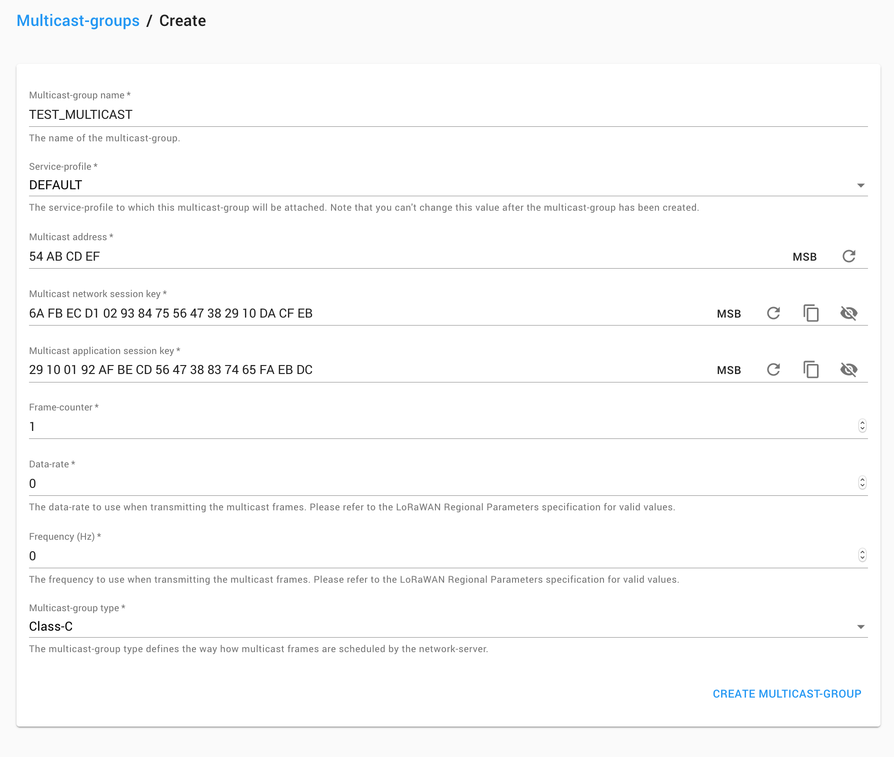
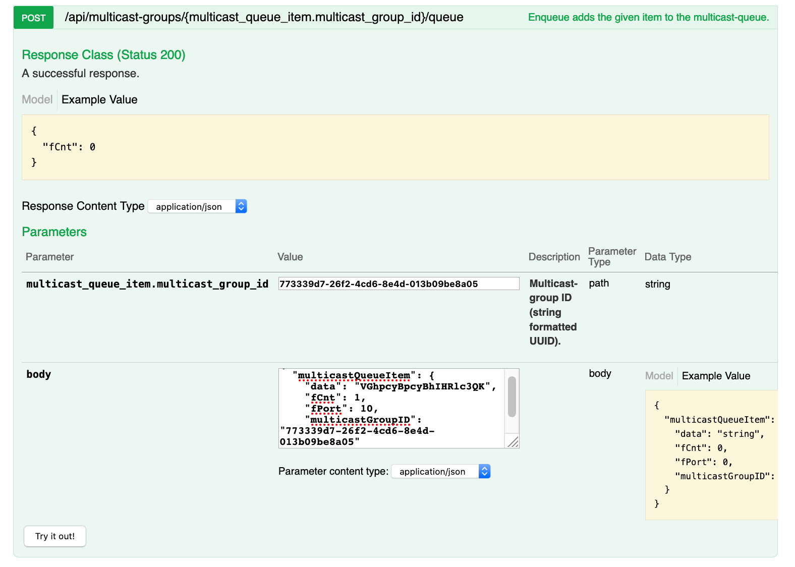
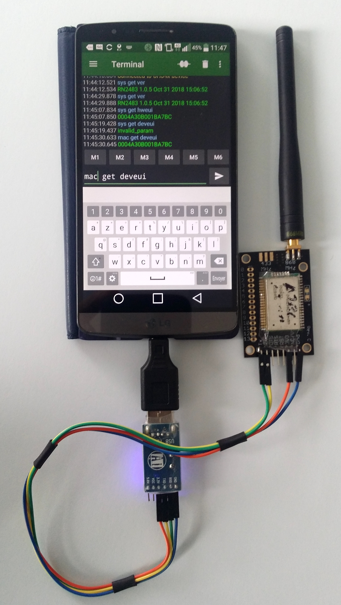

# CampusIoT :: Tutoriel :: Enregistrer et utiliser un modem Microchip RN2483 :fr:

Le module RN2483 est un module LoRa/LoRaWAN certifié qui sert de modem de communication à une machine hôte (PC, Mac, Smartphone) via un dongle USB serial (FTDI, ...), ou avec un micro-controleur (cartes Libelium, cartes SODAQ ...).

Le module existe sous la référence RN2483 pour l'Europe avec les bandes ISM 868 MHz et 433 MHz, et sous la référence RN2903 pour les USA, Canada, Australie et New Zealand. Il contient un composant Semtech SX1276 (capable de communiquer sur les bandes eu433 et eu868).

Les commandes du modem sont documentées ici: http://ww1.microchip.com/downloads/en/DeviceDoc/40001784B.pdf

Il y a 3 types de commandes pour accéder aux différentes fonctions du module:
* Fonctions de configuration et de controle d'un endpoint LoRaWAN Class A (mac)
* Fonctions de configuration de la radio LoRa (radio)
* Fonctions systèmes (sys)

> Remarque: Il existe des breakouts comme celui de [RN2483 breakout de Azzy's Electronics](https://www.tindie.com/products/DrAzzy/rn2483-breakout-bare-board/) à 3 USD pour y souder votre module et votre interface USB serial (FTDI) alimentée en 3.3V DC.

## Installer un client série
* Pour MacOS X, Linux ou Windows: [Coolterm](http://freeware.the-meiers.org/) [Tutoriel](https://learn.sparkfun.com/tutorials/terminal-basics/coolterm-windows-mac-linux)
* Pour Android, [Serial USB Terminal](https://play.google.com/store/apps/details?id=de.kai_morich.serial_usb_terminal)
https://play.google.com/store/apps/details?id=de.kai_morich.serial_usb_terminal
* `minicom` (Linux et Mac) : il faut configurer `minicom`  

## Connecter le modem
Configurer la fin de ligne à la valeur `<CR><LF>`. Attention, `ENTER` est interprété `<CR>` ou `<LF>` dans la configuration par défaut des applications de terminal série.

Connecter le modem avec le débit de 57600 bps, 8 bits, no parity, 1 Stop bit, no flow control (et l'émulation `<CR><LF>` pour `ENTER`).

> Pour CoolTerm, il faut configurer `Options > Terminal > Enter Key Emulation > CR+LF`.

## Inspecter le modem

Entrer les commandes suivantes dans le terminal série:
```
# lecture des informations du modem
sys get ver
>> RN2483 0.9.5 Mar 24 2015 14:15:33

sys get vdd
>> 2950

sys get hweui
>> 0004A30B001BA7BC
```

> Remarque : il peut être nécessaire de mettre à jour le firmware du module (via l'USB) pour que l'OTAA fonctionne (A lire https://www.microchip.com/forums/m1060340.aspx)

## Configurer la clé AppKey et l'AppEUI

```
mac get deveui
>> 0004A30B001BA7BC
mac get appeui
>> 0000000000000000

mac set appeui 0004A30B00123456
>> ok
mac set appkey 0004A30B001BA7BC0004A30B00123456
>> ok
mac set pwridx 1
>> ok

# Sauvegarder les paramêtres de manière persistante dans le module
mac save
>> ok
```

Tenter la procédure OTAA (alors que le device n'est pas enregistré)
```
mac join otaa
>> ok
# Et quelques secondes après
>> denied
```

## Enregistrer le modem dans le serveur

Créer une nouvelle application RN2483_MODEM.

Ajouter un device (device profile CLASS_A_OTAA) avec le DevEUI récupéré et l'AppKey sauvegardée dans le module.

## Envoyer des messages (uplink)

```
mac tx cnf 1 01020304
>> not_joined

# Configurer le datarate initial (de 0 à 5).
mac set dr 0
>> ok

# Tenter de nouveau la procédure OTAA
mac join otaa
>> ok
# Et quelques secondes après
>> accepted

# Envoyer un message uplink confirmed (au format hexadécimal) sur le port 1
mac tx cnf 1 01020304
>> ok
>> mac_tx_ok

# Envoyer un message uplink unconfirmed (au format hexadécimal) sur le port 2
mac tx uncnf 2 05060708
>> ok
>> mac_tx_ok
```

## Recevoir des messages (downlink)

```bash
> echo HelloWorld | base64
SGVsbG9Xb3JsZAo=
```


```
# Envoyer un message uplink confirmed (au format hexadécimal) sur le port 3
mac tx cnf 3 010B0C0D
>> ok
>> mac_rx 10 48656C6C6F576F726C640A
```

## Reconfigurer la couche Mac
```
mac pause

mac reset 868

mac set deveui 0004A30B001BA7BC
mac set appeui 0004A30B00123456
mac set appkey 0004A30B001BA7BC0004A30B00123456
mac set pwridx 1


mac set dr 0
mac set adr on
mac set bat 127
mac set retx 2
mac set linkchk 100
mac set rxdelay1 1000
mac set ar on
mac get rx2 868
mac set rx2 3 869525000


mac get ch freq 0
mac get ch freq 1
mac get ch freq 2
mac get ch dcycle 0
mac get ch dcycle 1
mac get ch dcycle 2

# set DC to 50%
mac set ch dcycle 0 1
mac set ch dcycle 1 1
mac set ch dcycle 2 1

mac save

mac join otaa

mac tx cnf 1 01020304
mac tx uncnf 1 0102034
```

## Configuration en classe C
Depuis la version 1.0.5, le module RN2483 peut être configuré en classe C.

```
mac set class c
mac save
mac join otaa
```

## Recevoir des messages (downlink) en classe C

```bash
> echo HelloWorld | base64
SGVsbG9Xb3JsZAo=
```

```
>> mac_rx 5 48656C6C6F576F726C640A
>> mac_tx_ok
```

## Configuration du multicast

Depuis la version 1.0.5, le module RN2483 peut recevoir de messages sur une adresse multicast.

```
mac set mcastdevaddr 54ABCDEF
mac set mcastappskey 29100192AFBECD564738837465FAEBDC
mac set mcastnwkskey 6AFBECD1029384755647382910DACFEB
mac set mcastdnctr 1
mac set mcast on
mac save
```

## Création d'un groupe multicast sur Chripstack



## Recevoir des messages (downlink) multicast

```bash
> echo "This is a test" | base64
VGhpcyBpcyBhIHRlc3QK
```

A envoyer via l'API de Chirpstack https://lns.campusiot.imag.fr/api#!/MulticastGroupService/Enqueue



```json
{
  "multicastQueueItem": {
    "data": "VGhpcyBpcyBhIHRlc3QK",
    "fCnt": 2,
    "fPort": 11,
    "multicastGroupID": "773339d7-26f2-4cd6-8e4d-013b09be8a05"
  }
}
```

## Remarque:
Le modem RN2483 est utilisé pour le [Field Tester](https://github.com/CampusIoT/lora-field-tester) de CampusIoT.

## Mise à jour du firmware du RN2483
Les anciennes versions du firmware des modules RN2483 doivent être mises à jour en suivant la [procédure suivante via l'UART](https://www.pocketmagic.net/rn2483-rn2903-firmware-upgrade-guide/).

## Bibliothèque  Arduino pour le RN2483
* https://github.com/Libelium/waspmoteapi/tree/master/libraries/LoRaWAN
* https://github.com/SodaqMoja/Sodaq_RN2483/tree/master/src 
* [RN2483-Arduino-Library](https://github.com/thingsat/tinygs_2g4station/tree/main/Firmware/Arduino/RN2XX3_LoRaWAN_Modem/RN2XX3_Simple)


## Bibliothèque RIOT OS pour RN2483
* https://github.com/RIOT-OS/RIOT/tree/master/drivers/rn2xx3

L'exemple du [tests/driver_rn2xx3](https://github.com/RIOT-OS/RIOT/tree/master/tests/driver_rn2xx3) permet d'utiliser des commandes shell de RIOT OS pour dialoguer avec le modem.

```
sys <sleep|reset|factoryRESET>
mac get <deveui|appeui|devaddr|txport|txmode|poweridx|dr|adr|band|retx|rx1|rx2|ar|rx2dr|rx2freq>
mac set <deveui|appeui|appkey|devaddr|appskey|nwkskey|txport|txmode|pwridx|dr|adr|bat|retx|linkchk|rx1|ar|rx2dr|rx2freq|sleep_duration> <value>
mac save
mac join <otaa|abp>
mac tx <payload>
```
    
## Galerie


