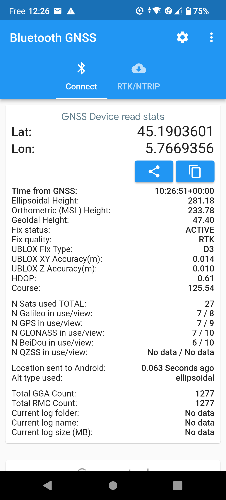
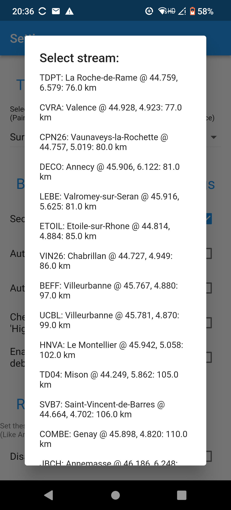
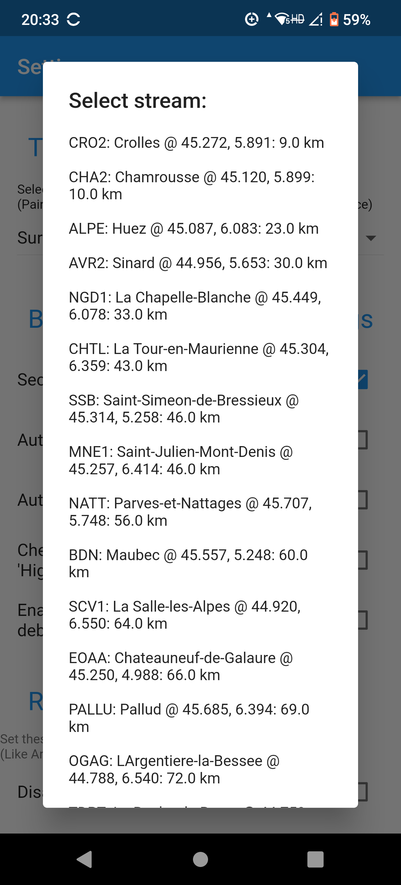
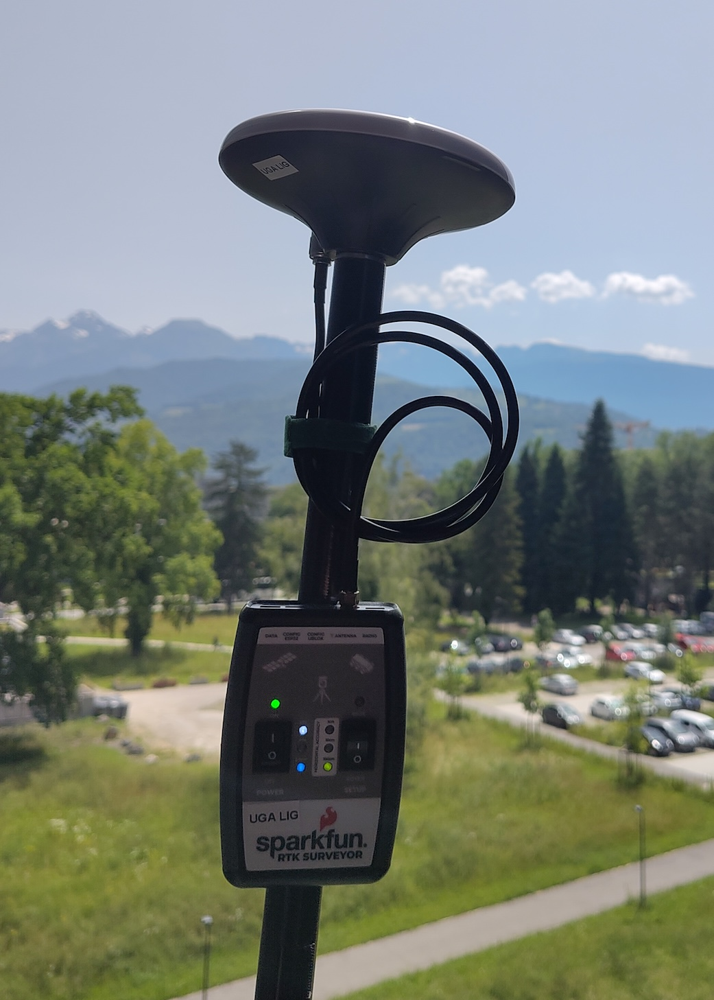
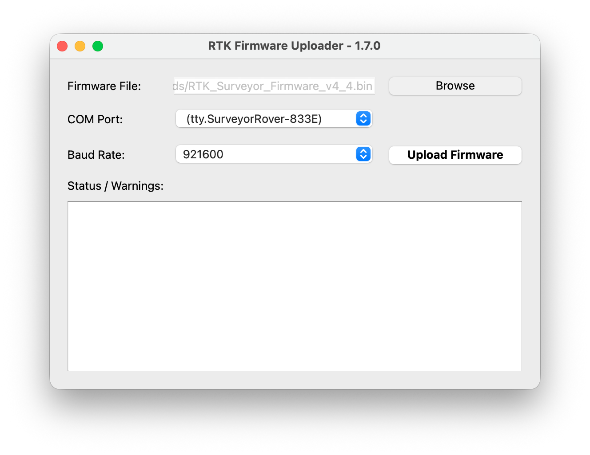

# SparkFun RTK Surveyor

* https://www.sparkfun.com/products/18443
* https://learn.sparkfun.com/tutorials/sparkfun-rtk-surveyor-hookup-guide/all
* https://docs.sparkfun.com/SparkFun_RTK_Firmware/

## [Centipede](https://docs.centipede.fr/)
On Grenoble, Centipede reference stations are `CRO2` and `CHA2`.

## Bluetooth GNSS app (for Android)x

Install the [application Bluetooth GNSS on your Android smartphone](https://play.google.com/store/apps/details?id=com.clearevo.bluetooth_gnss)

* https://docs.centipede.fr/docs/Rover_rtklib_android/
* http://jmfriedt.free.fr/glmf_altitude.pdf

> NB: you should setup your Android phone in [Developer Mode](https://developer.android.com/studio/debug/dev-options?hl=fr) : Go to the Settings screen. Select About Phone. Press Build Number seven times until you are now a developer! is visible.

> NB: Eduroam filters NTRIP traffic (TCP 2101). Switch on your 4G phone connection.

## Misc

### Updating RTK Firmware 

https://github.com/sparkfun/SparkFun_RTK_Firmware/releases

https://docs.sparkfun.com/SparkFun_RTK_Firmware/firmware_update/#windows

### Updating u-blox Firmware

https://docs.sparkfun.com/SparkFun_RTK_Firmware/firmware_update/#updating-u-blox-firmware
