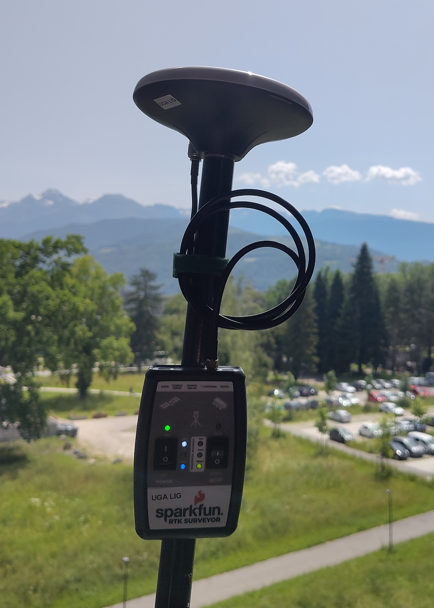

# SparkFun RTK Surveyor

* https://www.sparkfun.com/products/18443
* https://learn.sparkfun.com/tutorials/sparkfun-rtk-surveyor-hookup-guide/all
* https://docs.sparkfun.com/SparkFun_RTK_Firmware/

## [Centipede](https://docs.centipede.fr/)
On Grenoble, Centipede reference stations are `CRO2` and `CHA2`.

## Bluetooth GNSS app (for Android)

https://docs.centipede.fr/docs/Rover_rtklib_android/

> NB: you should setup your Android phone in [Developer Mode](https://developer.android.com/studio/debug/dev-options?hl=fr) : Go to the Settings screen. Select About Phone. Press Build Number seven times until you are now a developer! is visible.

> NB: Eduroam filters NTRIP traffic (TCP 2101). Switch on your 4G phone connection.

