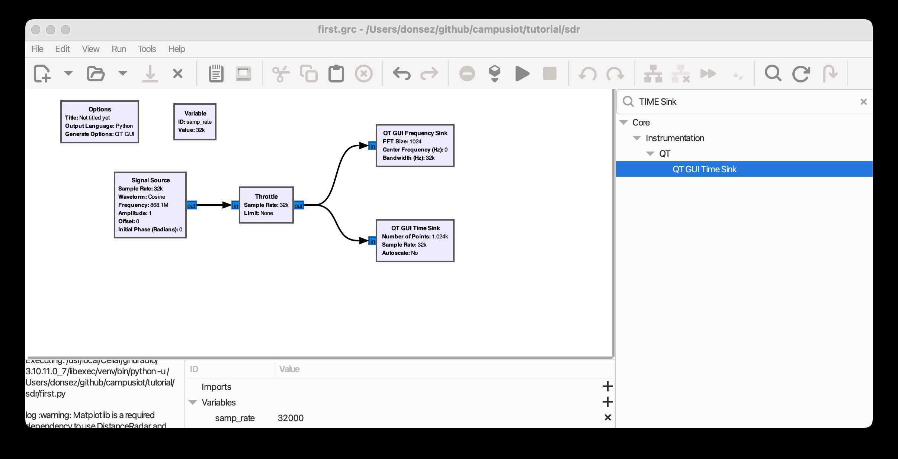

# Software Defined Radio


# SDR equipments

* [RTL2838UHIDIR (RTL SDR DBV Key)](https://www.passion-radio.fr/recepteurs-sdr/rtl-sdr-r820t2-248.html)
* [HackRF One](https://www.passion-radio.fr/emetteur-sdr/hackrf-sdr-75.html)
* [PlutoSDR](https://www.passion-radio.fr/emetteur-sdr/pluto-sdr-788.html)
* [RTL SDR](https://www.rtl-sdr.com/)

## GNU Radio

### Install MacOS
* https://wiki.gnuradio.org/index.php/MacInstall

```bash
brew install gnuradio
```

### Launch GNU Radio

https://wiki.gnuradio.org/index.php?title=Your_First_Flowgraph

```bash
gnuradio-companion
```

### Design your first flow

[.grc](first.grc), [.py](first.py)



## [`gqrx`](https://www.gqrx.dk/) : Software-defined radio receiver powered by GNU Radio and Qt

https://www.jeffreythompson.org/blog/2015/10/11/sdrhackrf-one-mac-setup-and-basics/

### Installation
```bash
brew install gqrx
gqrx
```
### Configuration

https://gqrx.dk/doc/practical-tricks-and-tips#more-229


## Modulations catalog

### LoRa
* [GNU Radio LoRa SDR](https://github.com/tapparelj/gr-lora_sdr)
* [SDR LoRa](https://www.google.fr/search?num=100&site=&source=hp&q=SDR+lora)

### FSK
* https://wiki.gnuradio.org/index.php/Simulation_example:_FSK
* https://wiki.gnuradio.org/images/9/9e/FSK_example.grc


## Misc

### Reading and Writing Binary Files

https://wiki.gnuradio.org/index.php?title=Reading_and_Writing_Binary_Files

## Ressources

* http://jmfriedt.free.fr/ 
* http://jmfriedt.free.fr/trans_num_l3_1_eng2025.pdf

## Books

* Travis F. Collins, Robin Getz, Di Pu, Alexander M. Wyglinski, [Software-Defined Radio for Engineers](docs/SDR4Engineers.pdf)
* Jean-Michel Friedt, Herve Boeglen, Communication Systems Engineering with GNU Radio: A Hands-on Approach, [ISBN: 978-1-394-21889-9](https://www.wiley.com/en-us/Communication+Systems+Engineering+with+GNU+Radio%3A+A+Hands-on+Approach-p-9781394218899), October 2024, 352 pages
