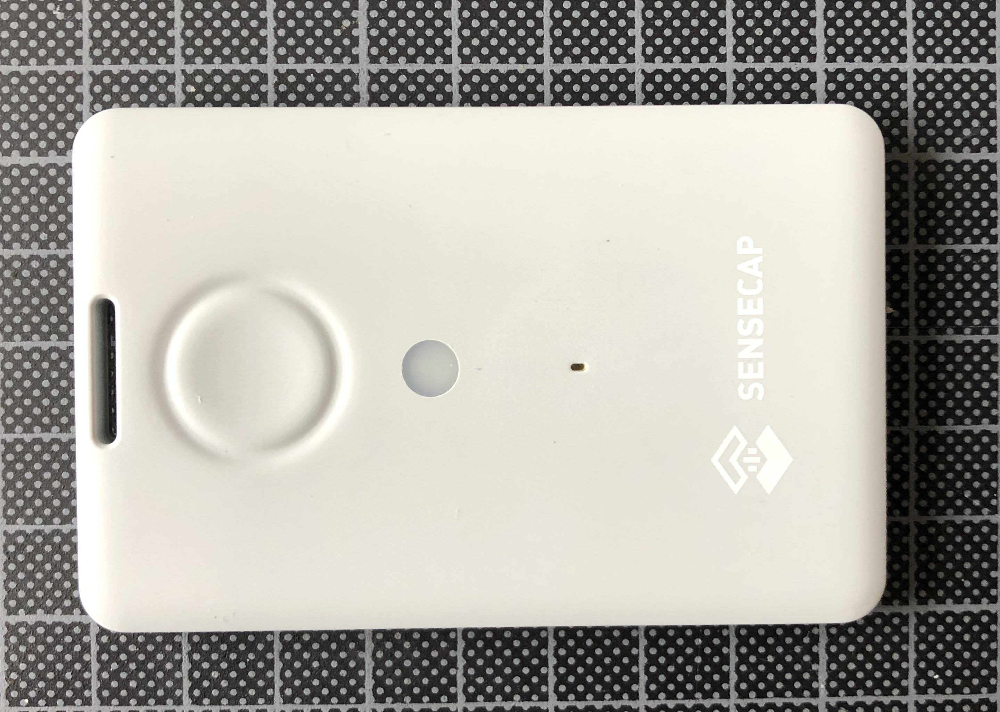
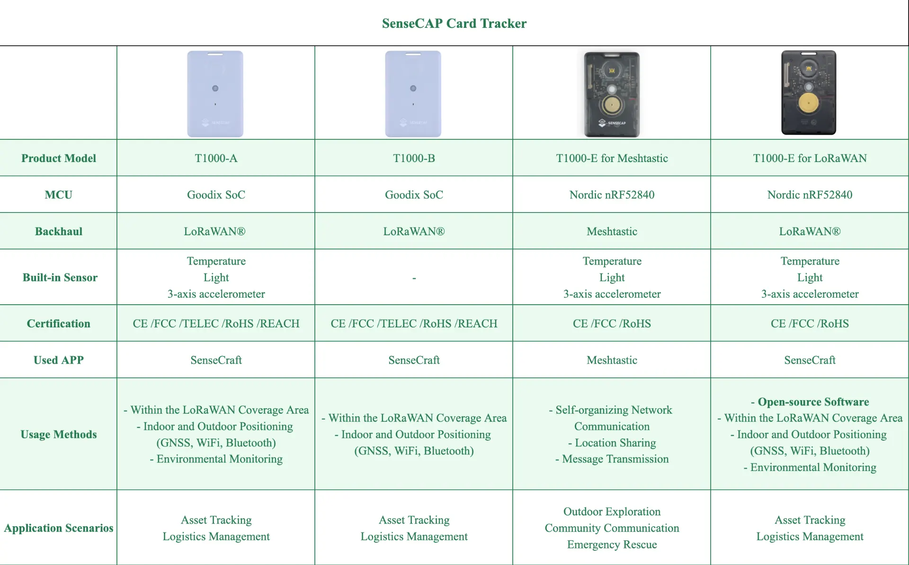

# Seeedstudio SenseCAP T1000 

Low cost tracker based on nRF52840 MCU and Semtech LR1110 + GNSS AG3335

## T1000-A LoRaWAN

* https://www.seeedstudio.com/sensecap-t1000-tracker
* https://www.disk91.com/2023/news/lorawan/sensecap-t1000-a-tracker/
* https://wiki.seeedstudio.com/Get_Started_with_SenseCAP_T1000_tracker/
* Decoder : https://wiki.seeedstudio.com/SenseCAP_Decoder/
* Payload format : https://wiki.seeedstudio.com/T1000_payload/

## T1000-B LoRaWAN

## T1000-E LoRaWAN

[Notes](t1000e-lorawan.md)

## T1000-E LoRaMesh (MeshCore & Meshtastic)

* https://gricad-gitlab.univ-grenoble-alpes.fr/meshtastic/catalog/-/tree/master/firmware/meshtastic/tracker-t1000-e?ref_type=heads
* https://gricad-gitlab.univ-grenoble-alpes.fr/meshtastic/meshcore