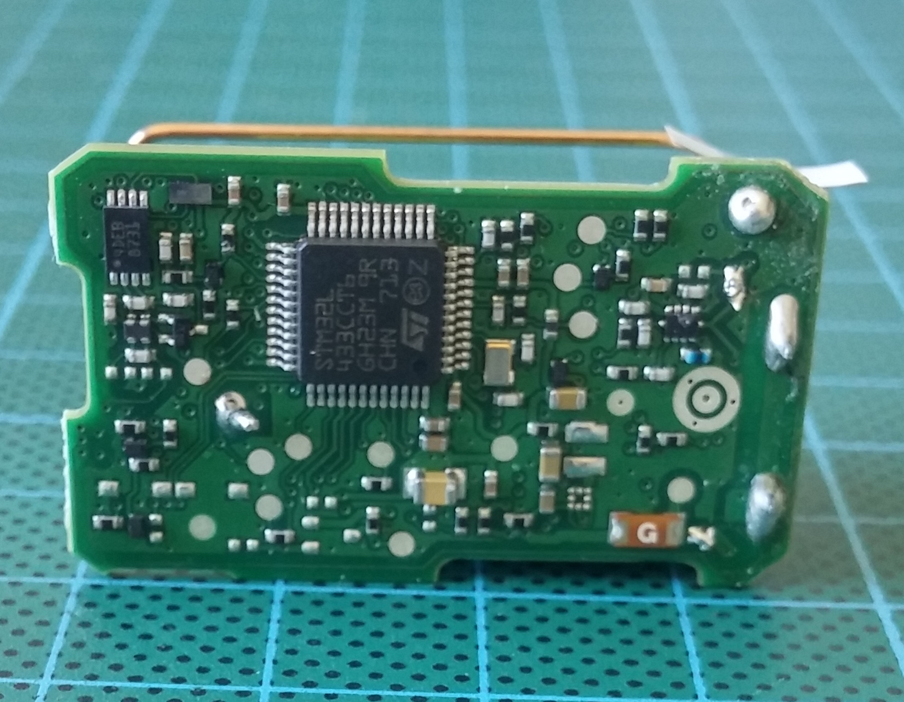
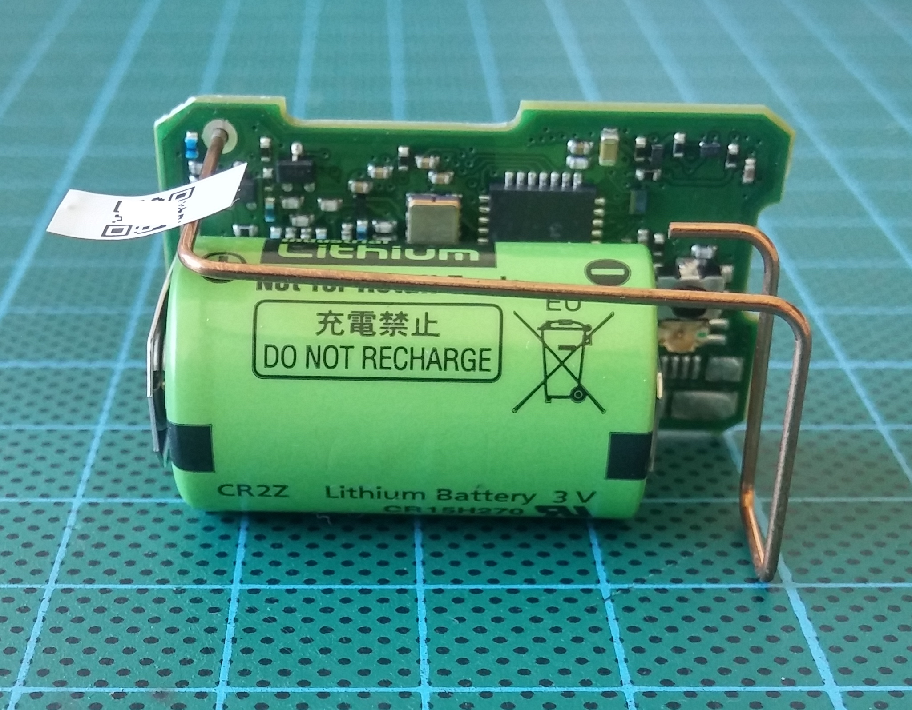
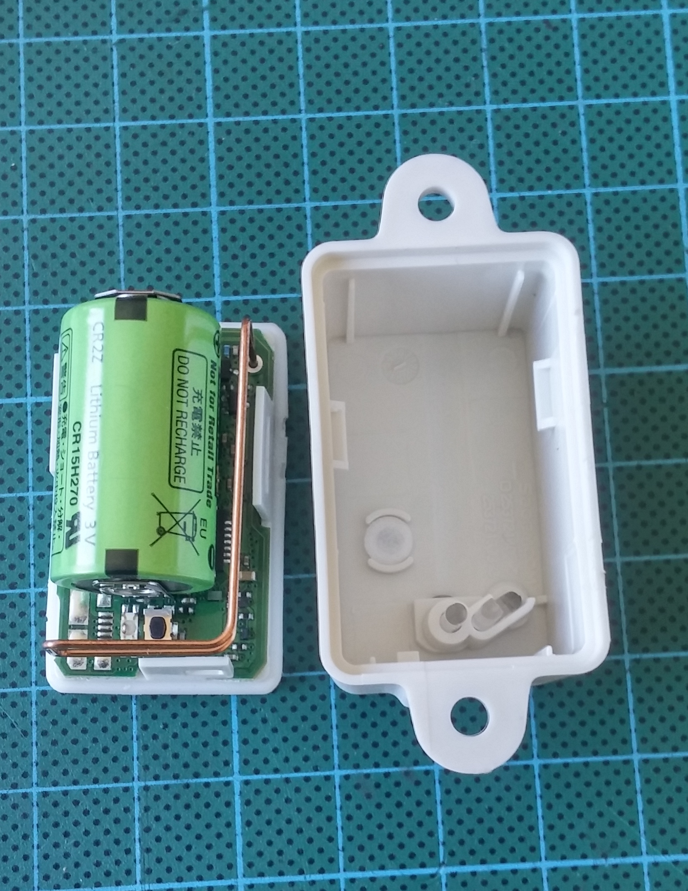
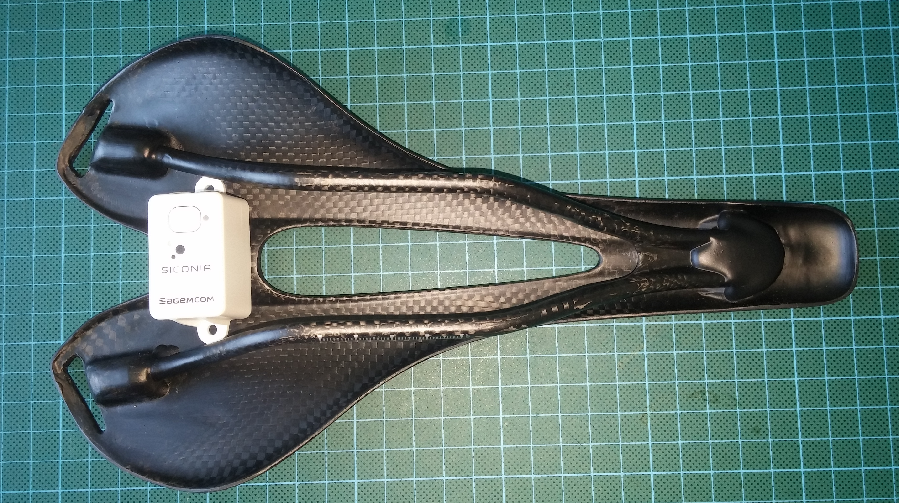

# CampusIoT :: Tutoriel :: SagemCom Siconia :fr:

## Mise en oeuvre
En configuration de sortie usine, l'équipement est actif, mais en mode dit « Avion » (transmission radio interdite) et de consommation extrêmement réduite. Placé sur un [support de communication NFC](https://www.st.com/en/evaluation-tools/m24lr-discovery.html), il est possible de le réveiller et de lui installer un script applicatif, via un application adaptée.

En mode OTAA, l'équipement est livré avec sa clé propre `AppKey`, et d’un identifiant `JoinEUI` qui est commun à un lot de fabrication donné. Il n’est pas possible de lire ni modifier la clé `AppKey` de l'équipement par le script applicatif. La clé `AppKey` est transmise à son propriétaire par le vendeur au moyen d'un canal indépendant approprié.


## Enregistrement de l'équipement
Créer une nouvelle application `SICONIA`.

Ajouter un device (device profile `CLASS_A_OTAA`) avec le `DevEUI` récupéré (étiquette sur le dos du boitier) et l'`AppKey` communiquée par le vendeur.


## Utilisation du script applicatif par défaut des devices
Le script par défaut provoque un comportement du produit en fonction de la durée d’appui sur le bouton :

En relâchant le bouton avant 3 secondes d’appui,
* Si le mode Avion est désactivé, alors il y a émission d’une trame LoRAWAN, et le voyant vert clignote.

La trame émise contient comme information la température relevée par le produit.
* Si le mode Avion est activé, alors rien ne se passe

En relâchant le bouton entre 3 et 6 secondes d’appui, on active/désactive le mode Avion
* Lorsque le mode Avion est activé, le voyant rouge clignote
* Lorsque le mode Avion est désactivé, le voyant vert clignote

Cet état est volatile : en cas de redémarrage du produit, le mode Avion redevient activé par défaut.


En relâchant le bouton entre 6 et 9 secondes d’appui,
o Le mode Avion est désactivé (l’émission est donc rendue possible)
o Le produit tente de joindre le réseau LORA (Join Request émis et attente temporisée)
o Le voyant clignote en orange

En cas de non réponse à la requête du Join, l'équipement redémarre au bout de 2 minutes.

En relâchant le bouton après 9 secondes d’appui, l'équipement est redémarré.

## Changement du script par USB Serial pour les modèles de développement

Les modèles de développement sont équipés d'une prise micro-USB pour permettre la mise au point itérative du script applicatif.

Il faut utiliser une application de terminal série (comme CoolTerm, Zterm, Putty, ...) pour se connecter à l'invité de commande (ie prompt). Les paramêtres de connection sont : 9600 baud et terminaison de ligne <CR>.

Copier coller le script suivant:
```
TODO

```


## Changement du script par NFC pour les modèles de production
Les modèles de production (qui sont étanches) sont dépourvus de prise micro-USB. Le script applicatif que vous avez mis au point précédemment est chargé dans l'équipement par une liaison NFC au moyen d'un [lecteur NFC STM](https://www.st.com/en/evaluation-tools/m24lr-discovery.html)


## Bibliothéques de scripts
Plusieurs scripts applicatifs sont disponibles ici : https://github.com/CampusIoT/endpoints/tree/master/siconia

## Annexe

### Galerie





