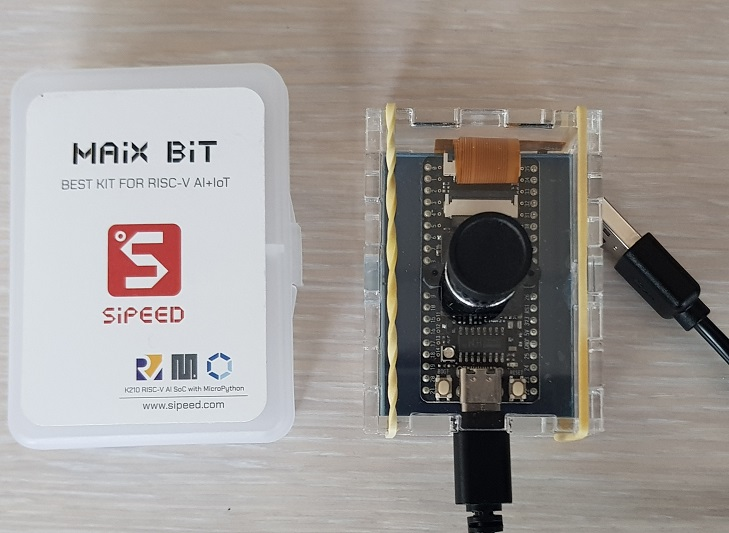
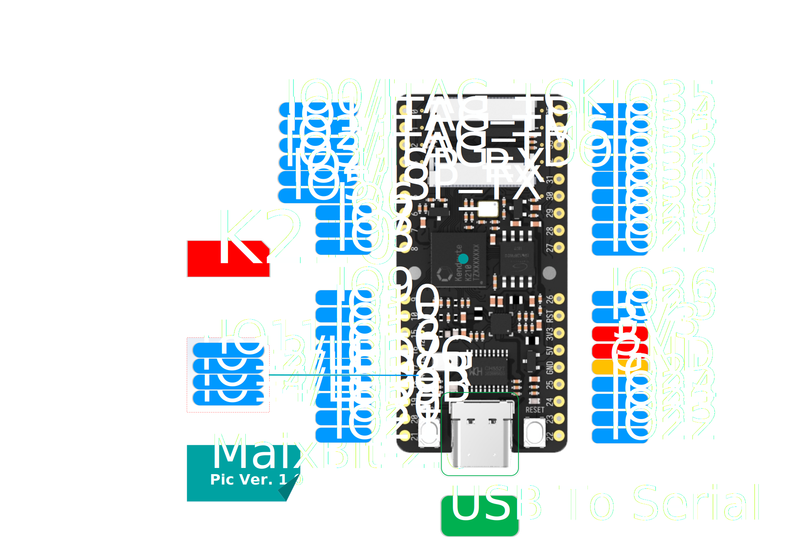

# Sipeed Maix Bit

La carte Sipeed Maix Bit est une carte de développement dotée d'un processeur double coeur RISC-V. Elle est dotée d'une camera et d'un écran TFT 320*240 points, ainsi qu'un lecteur de SDCard.





## Mise à jour du firmware

Téléchargez la dernière version du [firmware](http://dl.sipeed.com/shareURL/MAIX/MaixPy/release/master) en choisissant celle qui conviendra à vos futurs usages. Les différentes versions sont décrites dans le fichier `readme.txt`.

TODO

## Démarrage

Connectez vous à la console UART 

```console
>>> help()
Welcome to MicroPython on the Sipeed Maix!

For generic online docs please visit https://maixpy.sipeed.com

Official website : http://www.sipeed.com


Control commands:
  CTRL-A        -- on a blank line, enter raw REPL mode                         
  CTRL-B        -- on a blank line, enter normal REPL mode                      
  CTRL-C        -- interrupt a running program                                  
  CTRL-D        -- on a blank line, do a soft reset of the board                
  CTRL-E        -- on a blank line, enter paste mode                            
                                                                                
For further help on a specific object, type help(obj)                           
For a list of available modules, type help('modules')                           
>>> help('modules')                                                             
KPU               errno             pye_mp            uio                       
Maix              fpioa_manager     random            ujson                     
__main__          gc                re                uos                       
_boot             hashlib           sensor            urandom                   
_thread           heapq             socket            ure                       
_webrepl          image             struct            usocket                   
array             json              sys               ustruct                   
audio             lcd               time              utime                     
binascii          machine           ubinascii         utimeq                    
board             math              ucollections      uzlib                     
builtins          math              ucryptolib        video                     
clock             micropython       uctypes           websocket                 
cmath             nes               uerrno            zlib                      
collections       network           uhashlib                                    
cpufreq           os                uheapq                                      
Plus any modules on the filesystem                                              
>>> 
```

## Informations système

Vérifiez la version du firmware à la console avec

```python
import sys
print("implementation:", sys.implementation)
print("platform:", sys.platform)
print("path:", sys.path)
print("Python version:", sys.version)
```

Affichez la version du firmware sur l'écran LCD avec

```python
try:
    import gc, lcd, image
    gc.collect()
    lcd.init()
    loading = image.Image(size=(lcd.width(), lcd.height()))
    loading.draw_rectangle((0, 0, lcd.width(), lcd.height()), fill=True, color=(255, 0, 0))
    info = "Welcome to MaixPy"
    loading.draw_string(int(lcd.width()//2 - len(info) * 5), (lcd.height())//4, info, color=(255, 255, 255), scale=2, mono_space=0)
    v = sys.implementation.version
    vers = 'V{}.{}.{} : maixpy.sipeed.com'.format(v[0],v[1],v[2])
    loading.draw_string(int(lcd.width()//2 - len(info) * 6), (lcd.height())//3 + 20, vers, color=(255, 255, 255), scale=1, mono_space=1)
    lcd.display(loading)
    del loading, v, info, vers
    gc.collect()
finally:
    gc.collect()
```

## Autres exemples

Testez les exemples disponibles dans les différents répertoires du [dépôt de scripts MicroPython](https://github.com/sipeed/MaixPy_scripts#directory-structure).

| directory | description |
| --------- | ----------- |
| application   | Some complex applications |
| basic         | basic micropython usage |
| board         | run python code, config your sipeed hardware |
| hardware      | hardware API usage demo |
| machine_vision | demo for vision related, including machine vision and AI processing related |
| modules       | external modules |
| multimedia    | normal multimedia processing, audio video game etc. |
| network       | network related |

Chargez les scripts en utilisant TODO

Sélection:
* [Gimbal](https://github.com/sipeed/MaixPy_scripts/tree/master/application/gimbal)


## Misc

* [PMMA Enclosure](./sipeed_maix_bit_enclosure.svg) by Germain Lemasson, FabMSTIC

## Références

* [MaixPy firmware](http://dl.sipeed.com/shareURL/MAIX/MaixPy/release/master)
* [Models](http://dl.sipeed.com/shareURL/MAIX/MaixPy/model)
* [Sipeed Maix Bit](https://wiki.sipeed.com/soft/maixpy/en/develop_kit_board/maix_bit.html)
* [maixpy](https://wiki.sipeed.com/soft/maixpy/en/)
* [Scripts d'exemple](https://github.com/sipeed/maixpy_scripts)
* [Projet de reconnaissance d'images](https://github.com/Th3CracKed/M2M_Image_Recognition)
* [See Doc Section](https://www.seeedstudio.com/Sipeed-MAix-BiT-for-RISC-V-AI-IoT-1-p-2873.html)

