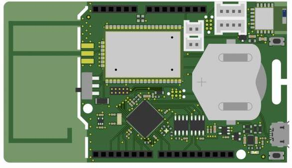
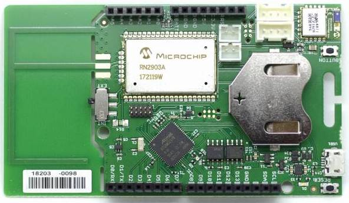
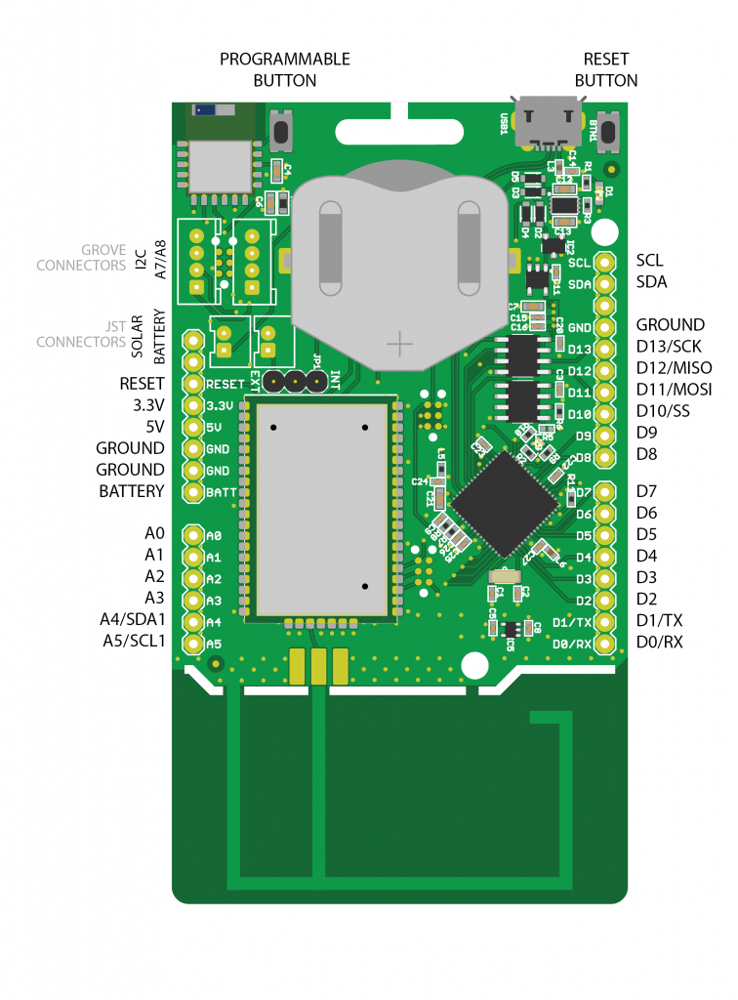
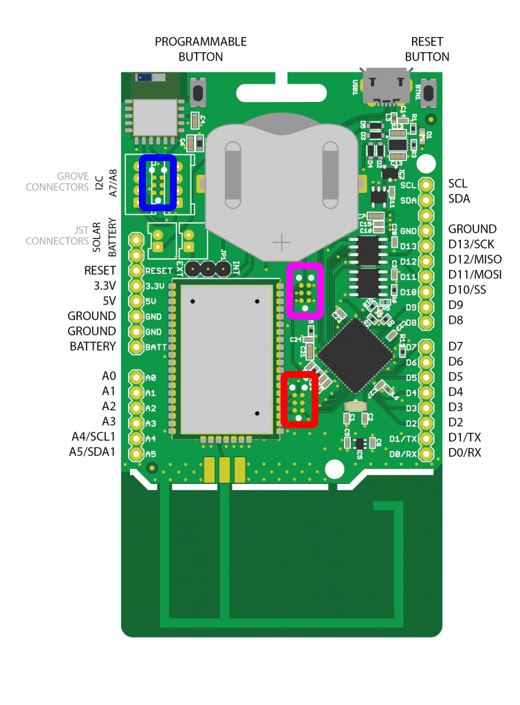

# CampusIoT :: SODAQ ExpLoRer :: Tutoriel :fr:

Si ce tutoriel vous est utile, pensez à donner une étoile :star: en haut à droit.

Ce tutoriel a pour objectif de programmer une carte [SODAQ ExpLoRer](https://support.sodaq.com/Boards/ExpLoRer/) et de l'enregistrer sur le réseau LoRaWAN de CampusIoT.

La carte [SODAQ ExpLoRer](https://support.sodaq.com/Boards/ExpLoRer/) se présente comme les 2 figures ci-dessous:







## Installation de l'IDE Arduino
Pour programmer la carte Sodaq Explorer, vous devez installer la dernière version de l'environnement de développement Arduino IDE pour votre machine https://www.arduino.cc/en/Main/Software

Vous pouvez le tutoriel d'installation du SODAQ ExpLoRer https://support.sodaq.com/Boards/ExpLoRer/

Une fois l'installation terminée, lancez l'environnement de développement Arduino IDE et configurez dans l'onglet "`Paramètres Preférences ...`"  l'URL 
http://downloads.sodaq.net/package_sodaq_samd_index.json dans le champs "`URL de gestionnaire de cartes supplémentaires`". Validez en cliquant sur "`OK`".

Allez ensuite dans "`Outils > Type de Carte > Gestionnaire de Carte`". Tapez "Sodaq" dans la barre de recherche. Installez la dernière version du paquet "`SODAQ SAMD Boards by SODAQ`".

Une fois, le paquet installé, sélectionnez la carte "`Sodaq Explorer`" dans le menu "`Outils > Type de Cartes`", puis sélectionnez le "bon" port dans le menu "`Outils > Type de Carte > Port`".

Vous pouvez ouvrir le croquis "`Blink`" ("`Fichier > Exemples > 01.Basic`") et lancer son téléversement ("Croquis > Téléverser") pour vérifier la chaine de compilation et de téléversement.

## Support de LoRa/LoRaWAN de la carte

Le support pour LoRaWAN est décrit ici : https://support.sodaq.com/Boards/ExpLoRer/Examples/lorawan/

Le support pour LoRa en P2P (peer-to-peer) est décrit ici : https://support.sodaq.com/Boards/ExpLoRer/Examples/lora_p2p/

## Installer le programme de thermomètre LoRaWAN sur la carte Explorer

Ouvrez un nouveau sketch et copier le [sketch suivant](https://raw.githubusercontent.com/CampusIoT/endpoints/master/sodaq/Sodaq_OTAA_temp.ino):

```
// https://support.sodaq.com/Boards/ExpLoRer/Examples/lorawan/

#include <Sodaq_RN2483.h>

#define debugSerial SerialUSB
#define loraSerial Serial2

#define NIBBLE_TO_HEX_CHAR(i) ((i <= 9) ? ('0' + i) : ('A' - 10 + i))
#define HIGH_NIBBLE(i) ((i >> 4) & 0x0F)
#define LOW_NIBBLE(i) (i & 0x0F)

// Delay between 2 transmissions
// 60000 = 1 minute
#define TX_PERIOD 60000

// #define PIR_MOTION_PIN 9

// TODO add #ifdef for OTAA/ABP in order to shrink the firmware
//Use OTAA, set to false to use ABP
bool OTAA = true;

// ABP
// USE YOUR OWN KEYS!
const uint8_t devAddr[4] =
{
    0x00, 0x00, 0x00, 0x00
};

// USE YOUR OWN KEYS!
const uint8_t appSKey[16] =
{
  0x00, 0x00, 0x00, 0x00, 0x00, 0x00, 0x00, 0x00,
  0x00, 0x00, 0x00, 0x00, 0x00, 0x00, 0x00, 0x00
};

// USE YOUR OWN KEYS!
const uint8_t nwkSKey[16] =
{
  0x00, 0x00, 0x00, 0x00, 0x00, 0x00, 0x00, 0x00,
  0x00, 0x00, 0x00, 0x00, 0x00, 0x00, 0x00, 0x00
};

// OTAA
// With using the GetHWEUI() function the HWEUI will be used
uint8_t DevEUI[8] =
{
  0x00, 0x00, 0x00, 0x00, 0x00, 0x00, 0x00, 0x00,
};

const uint8_t AppEUI[8] =
{
  0x0c, 0xaf, 0xcb, 0x00, 0x00, 0xff, 0xff, 0xff
};

// 0400123428aed2a6abf7158809cf4f3c
const uint8_t AppKey[16] =
{
0x04, 0x00, 0x12, 0x34, 0x28, 0xae, 0xd2, 0xa6,
0xab, 0xf7, 0x15, 0x88, 0x09, 0xcf, 0x4f, 0x3c
};

void setup()
{
  delay(1000);

  while ((!debugSerial) && (millis() < 10000)){
    // Wait 10 seconds for debugSerial to open
  }

  debugSerial.println("Start");

  // Start streams
  debugSerial.begin(57600);
  loraSerial.begin(LoRaBee.getDefaultBaudRate());

  LoRaBee.setDiag(debugSerial); // to use debug remove //DEBUG inside library
  LoRaBee.init(loraSerial, LORA_RESET);

  //Use the Hardware EUI
  getHWEUI();

  // Print the Hardware EUI
  debugSerial.print("LoRa HWEUI: ");
  for (uint8_t i = 0; i < sizeof(DevEUI); i++) {
    debugSerial.print((char)NIBBLE_TO_HEX_CHAR(HIGH_NIBBLE(DevEUI[i])));
    debugSerial.print((char)NIBBLE_TO_HEX_CHAR(LOW_NIBBLE(DevEUI[i])));
  }
  debugSerial.println();  

  setupLoRa();
}

void setupLoRa(){
  if(!OTAA){
    // ABP
    setupLoRaABP();
  } else {
    //OTAA
    setupLoRaOTAA();
  }
  // Uncomment this line to for the RN2903 with the Actility Network
  // For OTAA update the DEFAULT_FSB in the library
  // LoRaBee.setFsbChannels(1);

  LoRaBee.setSpreadingFactor(9);
}

void setupLoRaABP(){  
  if (LoRaBee.initABP(loraSerial, devAddr, appSKey, nwkSKey, true))
  {
    debugSerial.println("Communication to LoRaBEE successful.");
  }
  else
  {
    debugSerial.println("Communication to LoRaBEE failed!");
  }
}

void setupLoRaOTAA(){

  if (LoRaBee.initOTA(loraSerial, DevEUI, AppEUI, AppKey, true))
  {
    debugSerial.println("Network connection successful.");
  }
  else
  {
    debugSerial.println("Network connection failed!");
  }
}

void loop()
{
  //String reading = getTemperature();
  int16_t temp = getTemperatureInt16();
  debugSerial.print("temperature:");
  debugSerial.println(temp/100.0);

//   switch (LoRaBee.send(1, (uint8_t*)reading.c_str(), reading.length()))
    switch (LoRaBee.send(1, (uint8_t*)&temp, sizeof(temp)))
    {
    case NoError:
      debugSerial.println("Successful transmission.");
      break;
    case NoResponse:
      debugSerial.println("There was no response from the device.");
      break;
    case Timeout:
      debugSerial.println("Connection timed-out. Check your serial connection to the device! Sleeping for 20sec.");
      delay(20000);
      break;
    case PayloadSizeError:
      debugSerial.println("The size of the payload is greater than allowed. Transmission failed!");
      break;
    case InternalError:
      debugSerial.println("Oh No! This shouldn't happen. Something is really wrong! The program will reset the RN module.");
      setupLoRa();
      break;
    case Busy:
      debugSerial.println("The device is busy. Sleeping for 10 extra seconds.");
      delay(10000);
      break;
    case NetworkFatalError:
      debugSerial.println("There is a non-recoverable error with the network connection. The program will reset the RN module.");
      setupLoRa();
      break;
    case NotConnected:
      debugSerial.println("The device is not connected to the network. The program will reset the RN module.");
      setupLoRa();
      break;
    case NoAcknowledgment:
      debugSerial.println("There was no acknowledgment sent back!");
      break;
    default:
      break;
    }
    // Delay between readings and transmissions
    delay(TX_PERIOD);
}

String getTemperature()
{
  //10mV per C, 0C is 500mV
  float mVolts = (float)analogRead(TEMP_SENSOR) * 3300.0 / 1023.0;
  float temp = (mVolts - 500.0) / 10.0;

  return String(temp);
}
// TODO for Cayenne LPP
// TODO https://github.com/myDevicesIoT/cayenne-docs/blob/master/docs/LORA.md
// TODO https://github.com/aabadie/cayenne-lpp
int16_t getTemperatureInt16()
{
  //10mV per C, 0C is 500mV
  float mVolts = (float)analogRead(TEMP_SENSOR) * 3300.0 / 1023.0;
  int16_t temp = (int16_t) (((mVolts - 500.0) / 10.0) * 100);

  return temp;
}

float getTemperatureFloat()
{
  //10mV per C, 0C is 500mV
  float mVolts = (float)analogRead(TEMP_SENSOR) * 3300.0 / 1023.0;
  float temp = ((mVolts - 500.0) / 10.0);

  return temp;
}

// TODO add Led for state and error notifications (https://support.sodaq.com/sodaq-one/led/)
// TODO add battery level in payload
// TODO send on button push
// TODO status byte (button flag, presence flag...)
// TODO get ADC grove connector value (potentiometer for instance)
// TODO add a PIR motion detector on pin 9 and add a presence counter into the payload
// TODO get GNSS module geolocation value on RX/TX pins. See http://forum.sodaq.com/search?q=GPS
// TODO add downlink (for TX_PERIOD configuration, number of readings per transmission, low and high temperature thresholds)
// TODO enable several readings per transmission


/**
* Gets and stores the LoRa module's HWEUI/
*/
static void getHWEUI()
{
  uint8_t len = LoRaBee.getHWEUI(DevEUI, sizeof(DevEUI));
}

/**
* set RGB led to red
*/
void RED() {
  digitalWrite(LED_RED, LOW);
  digitalWrite(LED_GREEN, HIGH);
  digitalWrite(LED_BLUE, HIGH);
}

/**
* set RGB led to green
*/
void GREEN() {
  digitalWrite(LED_RED, HIGH);
  digitalWrite(LED_GREEN, LOW);
  digitalWrite(LED_BLUE, HIGH);
}

/**
* set RGB led to blue
*/
void BLUE() {
  digitalWrite(LED_RED, HIGH);
  digitalWrite(LED_GREEN, HIGH);
  digitalWrite(LED_BLUE, LOW);
}

/**
* set RGB led to white
*/
void WHITE() {
  digitalWrite(LED_RED, LOW);
  digitalWrite(LED_GREEN, LOW);
  digitalWrite(LED_BLUE, LOW);
}

/**
* set RGB led to off
*/
void OFF() {
  digitalWrite(LED_RED, HIGH);
  digitalWrite(LED_GREEN, HIGH);
  digitalWrite(LED_BLUE, HIGH);
}

void setupRGBLED() {
  pinMode(LED_RED, OUTPUT);
  pinMode(LED_GREEN, OUTPUT);
  pinMode(LED_BLUE, OUTPUT);
}
```
Ajouter les 2 bibliothèques `SODAQ_wdt` et `SODAQ_RN2483` au sketch avec "`Croquis > Inclure une bibliothèque > Gérer les bibliothèques`" (filtrer la liste avec le mot clé "SODAQ").

TODO : Ajouter les 2 fichiers https://github.com/aabadie/cayenne-lpp dans le répertoire du sketch.

Configurer l'AppKey dans le sketch.

Compiler et charger (ie flash) le sketch sur la carte.

Récupérer le DevEUI dans la console série (9600 bps) via la trace `LoRa HWEUI: 0004A30B001234656`. Il s'agit de l'identifiant LoRa du module Microchip RN2483.

```
Start
LoRa HWEUI: 0004A30B001234656
Network connection failed!
temperature:23.22
The device is not connected to the network. The program will reset the RN module.
Network connection failed!
```

[Plus d'info](https://github.com/Orange-OpenSource/Orange-ExpLoRer-Kit-for-LoRa)

## Enregistrer le device SODAQ Explorer
Du coté de la console https://lns.campusiot.imag.fr

Créez une application `SODAQ_EXPLORER` avec le service-profile `DEFAULT`

Ajoutez un device avec `+ Add` en utilisant le `DevEUI` et l'`AppKey`

Affichez les messages du device depuis l'onglet "`Live LoRaWAN Frame`"

En parallèle, affichez les traces du sketch dans le moniteur serie (9600 bps) de l'IDE Arduino.

```
Start
LoRa HWEUI: 0004A30B001234656
Network connection failed!
temperature:24.51
The device is not connected to the network. The program will reset the RN module.
Network connection failed!
temperature:24.51
The device is not connected to the network. The program will reset the RN module.
Network connection successful.
temperature:24.83
Successful transmission.
temperature:24.27
Successful transmission.
```


[Plus de détail sur l'enregistrement de devices](../loraserver/README.md#cr%C3%A9er-une-application)

## Décoder les frames sur le serveur

Ajoutez la fonction de décodage "`Application > SODAQ_EXPLORER > Application Configuration > Payload Coded > Custom Javascript codec functions`" suivante:

```
// From https://github.com/feross/buffer/blob/master/index.js
function readInt16LE (buf, offset) {
  offset = offset >>> 0
  var val = buf[offset] | (buf[offset + 1] << 8)
  return (val & 0x8000) ? val | 0xFFFF0000 : val
}

// Decode decodes an array of bytes into an object.
//  - fPort contains the LoRaWAN fPort number
//  - bytes is an array of bytes
// The function must return an object, e.g. {"temperature": 22.5}
function Decode(fPort, bytes) {
  if(bytes.length === 2) {
  	return {
      	temperature: readInt16LE(bytes,0)/100.0
    };
  } else {
     return { badpayload: true };
  }
}
```

Affichez les messages du device depuis l'onglet "`Live Device Data`". Le payload du message est décodé dans la propriété `object` de l'objet JSON.

## Brancher plus de capteurs sur la carte.
Vous pouvez brancher des capteurs, des actionneurs ou des afficheurs sur les 2 connecteurs [Grove](http://wiki.seeedstudio.com/Grove_System/) de la carte (1 I2C et 1 Analogique/Digitale) et sur les 2 rangées de broche au format Arduino.

> Attention: il faut utiliser des capteurs avec un VCC de 3.3V

Le catalogue Groove de SeeedStudio est distribué en France par Farnell, [GoTronic](https://www.gotronic.fr/recherche_0-1|1357|1361_0_0_0_2_0.htm) et par [Lextronic](https://www.lextronic.fr/8369-systeme-grove).


Par exemple:
* [Grove GPS](http://wiki.seeedstudio.com/Grove-GPS/) avec [Sodaq_TinyGPS.ino](./https://raw.githubusercontent.com/CampusIoT/endpoints/master/sodaq/Sodaq_TinyGPS.ino)
* [SodaqOne-UniversalTracker](https://github.com/brocaar/SodaqOne-UniversalTracker)
* [Grove DS18B20](https://www.gotronic.fr/art-capteur-de-temperature-grove-101990019-23842.htm) avec [Sodaq_OTAA_DS18B20.ino](https://github.com/CampusIoT/endpoints/blob/master/sodaq/Sodaq_OTAA_DS18B20.ino)
* [Grove Dust Sensor](http://wiki.seeedstudio.com/Grove-Dust_Sensor/)
* [Grove LCD Display](http://wiki.seeedstudio.com/Grove-16x2_LCD_Series/)


## Construction et chargement d'un firmware avec RIOT OS

La carte [SODAQ Explorer](https://github.com/RIOT-OS/RIOT/blob/master/boards/sodaq-explorer/doc.txt) est supporté par RIOT OS. Si vous êtes familier avec RIOT OS.

Construisez et chargez le firmware de test pour le paquetage LoRaMAC :

```bash
cd pkg_semtech-loramac 
make BOARD=sodaq-explorer flash
```

Suivez les instructions du [README](https://github.com/RIOT-OS/RIOT/blob/master/tests/pkg_semtech-loramac/README.md) en utilisant le`DevEUI`.
```
loramac set deveui 0004A30B001234656
loramac set appeui 0004A30B00FFFFFFF
loramac set appkey 0004A30B0012346560004A30B001234656
loramac join otaa
loramac tx This\ is\ RIOT! cnf 2
```

## Pour aller plus loin
[Tutoriel NodeRED](../nodered/README.md)


## Annexes

[Documentation du fabricant : schématiques, documentations techniques ...](./docs)




Pinout Tag Connect Headers
* Blue : Bluetooth
* Red  : LoRa
* Pink : MCU 
