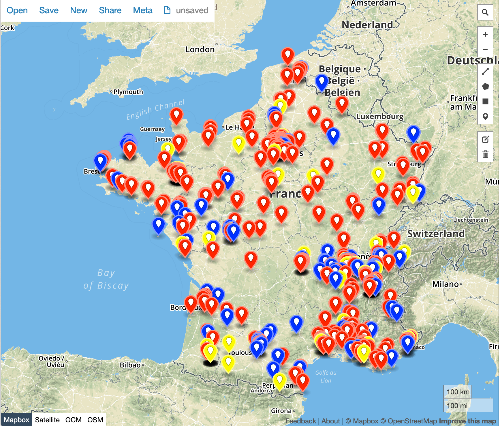

# CampusIoT :: Tutoriel TTN

Ce dossier regroupe quels outils pour l'utilisation de TTN.

## Bridge CampusIoT vers TTN
Ce simple bridge renvoie les messages de endpoints enregistrés sur TTN recus par des gateways de CampusIoT (chirpstack) vers TTN.

Dépôt : https://github.com/campus-iot/ttn-bridge

## API non documentée
```bash
# query all gateways 50km around LIG 45.1902768,5.765897
wget -q -O - 'https://www.thethingsnetwork.org/gateway-data/location?latitude=45.1902768&longitude=5.765897&distance=50000' | jq --unbuffered 

# query all gateways in France
wget -q -O - 'https://www.thethingsnetwork.org/gateway-data/country/fr' | jq --unbuffered 

# query all gateways in the world!
wget -q -O - 'https://www.thethingsnetwork.org/gateway-data/' | jq --unbuffered 

# query status of a gateway
GWEUI=0000024b08123456
wget -q -O - http://noc.thethingsnetwork.org:8085/api/v2/gateways/eui-$GWEUI | jq --unbuffered 
```

## Affichage des gateways

```bash
wget -q -O - 'https://www.thethingsnetwork.org/gateway-data/country/fr' | jq --unbuffered | node gateways2geojson.js > gateways_france.geojson
```

Visualisez le fichier gateways_france.geojson en l'ouvrant dans http://geojson.io


