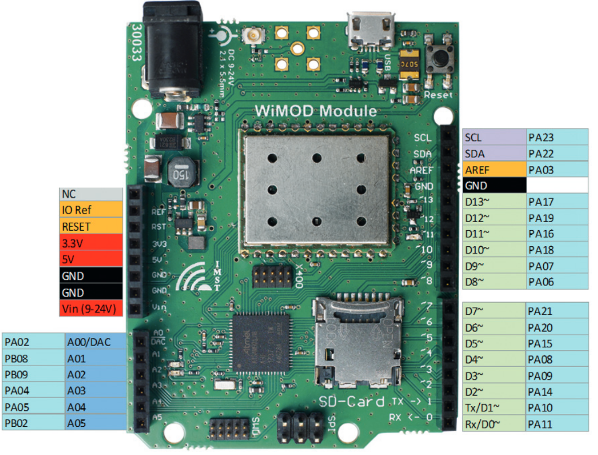
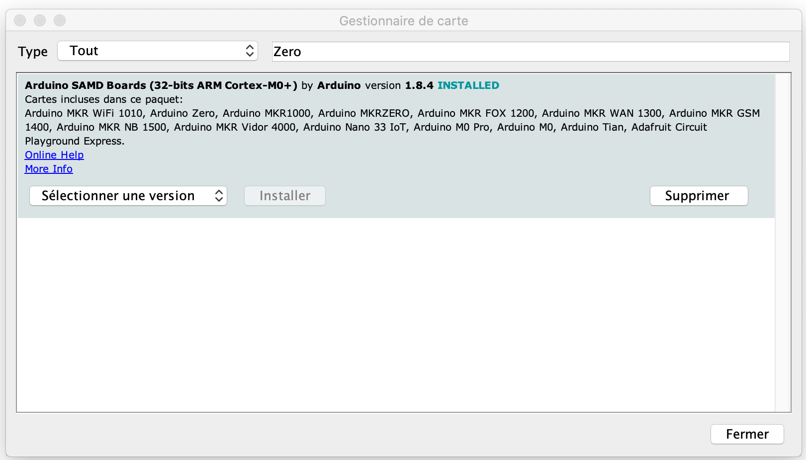

# CampusIoT :: WimoDino iM282A-L :: Tutoriel :fr:

## Objectif
L'objectif de ce tutoriel est de mettre en oeuvre un réseau de 2 cartes (ou plus) WimoDino iM282A-L communiquant en pair-à-pair au moyen de communication LoRa sur la bande 2.4GHz.

Si ce tutoriel vous est utile, pensez à donner une étoile :star: en haut à droit.

## LoRa 2.4GHz
TBC

TBC Semtech SX1280

## Carte d'évaluation IMST WimoDino iM282A-L

### Module IMST iM282A-L

https://www.wireless-solutions.de/products/radiomodules/im282a.html

* Frequency range: 	SRD Band 2.4 GHz
* Modulation: 	LoRa®, FLRC, (G) FSK
* RF output power: 	up to +12 dBm (50Ω pad)
* Receiver sensitivity: 	
    * LoRa:
        * -130 dBm (SF 12;  SB 203 kHz, CR 4/6)
        * -127 dBm (SF 12;  SB 406 kHz, CR 4/6)
        * -126 dBm (SF 12;  SB 812 kHz, CR 4/6)
        * -120 dBm (SF 12;  SB 1,625 kHz, CR 4/6)
* RF datarate: 	476 bps to 2.3  Mbps
* depending on modulation and settings
* RF range: 	up to 12 000 m (Line of Sight)
* Operating voltage: 	1.8 V to 3.6 V
* Current consumption: 	
    * 0.8 µA (module in sleep, RTC off)
    * 2 μA (module in sleep, RTC running)
    * 9 mA (Rx, MCU sleep)
    * 34 mA (Tx @ 3.0 V/ +12 dBm, MCU sleep)
    * 25 mA (Tx @ 3.0 V/ +8 dBm, MCU sleep)

### Carte compatible-Arduino WimoDino iM282A-L




TBC
* https://www.wireless-solutions.de/downloads/Evaluation-Tools/WiMODino/WiMODino_Datasheet_V1-0.pdf
* https://www.wireless-solutions.de/downloads/Evaluation-Tools/WiMODino/WiMODino_Flyer_V1-0.pdf


* Assembled with RED
* pre-certified LoRa®radio modules iM880B, iM282A, iM881A or iM980A
* Supports certified LoRaWAN® protocol stack
* Supports LR_Base (LoRa® protocol stack for P-2-P and P-2-Multi-P communication)
* RF range up to 15 km (LoS: Line of Sight)
* U.FL. connector for external antenna
* power supply external 9-24V DC or USB (micro)
* USB (micro), SPI, 2 USART, reset button, SD card holder, programming interfaces
* Compatible to Arduino UNO R3  pinout  (3.3V)
* Powerful Cortex M0+  ATSAMD21J18  (256KB flash, 32KB SRAM)
    * Interfaces SPIs, I²C, ADCs, UARTs, PWM channels, USB
    * Timer Counters (8/16/32 bit), RTC, Watchdog Timer
    * Debug support by non ArduinoTM IDEs


### LR-Base API

```c
// LR-BASE API 
Ping( )
Reset( )
GetDeviceInfo( )
GetFirmwareInfo( )
GetSystemStatus( )
GetRtc( )
SetRtc( )
GetRadioConfig( )
SetRadioConfig( )
SetAesKey( )
GetAesKey( )
SendUData( )
SendCData( )
SetAckData( )
```


## Installation de l'IDE Arduino
TBC



* https://www.wireless-solutions.de/download/Evaluation-Tools/WiMODino/WiMOD-ArduinoLib-V1_5_0.zip


## Exploration des exemples

```bash
> cd ~/Documents/Arduino/libraries/WiMOD/examples
> tree *
LR-BASE
├── LrBaseAES
│   └── LrBaseAES.ino
├── LrBaseFwInfos
│   └── LrBaseFwInfos.ino
├── LrBasePing
│   └── LrBasePing.ino
├── LrBaseRTC
│   └── LrBaseRTC.ino
├── LrBaseSetRadioConfig
│   └── LrBaseSetRadioConfig.ino
└── LrBaseSimpleChat
    └── LrBaseSimpleChat.ino
LR-BASE-PLUS
├── LrBasePlusFwInfos
│   └── LrBasePlusFwInfos.ino
└── LrBasePlusSimpleChat
    └── LrBasePlusSimpleChat.ino
LoRaWAN
├── LoRaWanEndNode_ABP
│   └── LoRaWanEndNode_ABP.ino
├── LoRaWanEndNode_CDATA
│   └── LoRaWanEndNode_CDATA.ino
├── LoRaWanEndNode_CDATA2
│   └── LoRaWanEndNode_CDATA2.ino
├── LoRaWanEndNode_EU_TxPwrLimits
│   └── LoRaWanEndNode_EU_TxPwrLimits.ino
├── LoRaWanEndNode_FwInfos
│   └── LoRaWanEndNode_FwInfos.ino
├── LoRaWanEndNode_OTAA
│   └── LoRaWanEndNode_OTAA.ino
├── LoRaWanEndNode_SimpleOTAA
│   └── LoRaWanEndNode_SimpleOTAA.ino
├── LoRaWan_CayenneBME280
│   └── LoRaWan_CayenneBME280.ino
├── LoRaWan_CayenneDemo
│   └── LoRaWan_CayenneDemo.ino
└── LoRaWan_CayenneTCS34726
    └── LoRaWan_CayenneTCS34726.ino
PC_Bridge
├── DUE_BtlBridge
│   └── DUE_BtlBridge.ino
├── DUE_UartBridge
│   └── DUE_UartBridge.ino
├── M0_UartBridge
│   └── M0_UartBridge.ino
├── UNO_BtlBridge
│   └── UNO_BtlBridge.ino
└── Uno_Wimod2PcBridge
    └── Uno_Wimod2PcBridge.ino
```


## Flashage du sketch LrBaseSimpleChat
TBC

```c
// TBC
```


