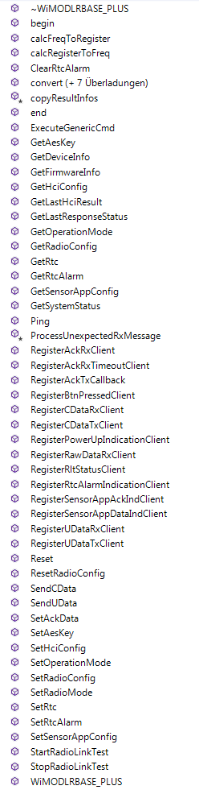

# CampusIoT :: WiMODino iM282A-L :: Tutoriel :fr:

## Objectif
L'objectif de ce tutoriel est de mettre en oeuvre un réseau de 2 cartes (ou plus) WiMODino iM282A-L communiquant en pair-à-pair au moyen de communication LoRa sur la bande 2.4GHz.

Si ce tutoriel vous est utile, pensez à donner une étoile :star: en haut à droit.

## LoRa 2.4GHz
LoRa (Long Range) est une modulation radio basse consommation d'énergie et très longue portée. Elle est bien adaptée aux applications "Internet des Objets" pour lesquelles les objets sont répartis sur des grands espaces ou pour lesquelles l'attenuation du signal est très fort (béton, ...).

Brévétée par la société Semtech, LoRa est modulée/démodulée par les composants SX127x pour les bandes de fréquence SubGHz.

Le composant [Semtech SX1280](https://www.semtech.com/products/wireless-rf/24-ghz-transceivers/SX1280) module/demodule sur la bande SRD 2.4 GHz. 

## Carte d'évaluation IMST WimoDino iM282A-L

### Module IMST iM282A-L
La société IMST commercialise le module de communication [iM282A-L](https://www.wireless-solutions.de/products/radiomodules/im282a.html) comportant le composant Semtech SX1280.

Les caractéristiques de ce module sont : 
* Frequency range: 	SRD Band 2.4 GHz
* Modulation: 	LoRa®, FLRC, (G) FSK
* RF output power: 	up to +12 dBm (50Ω pad)
* Receiver sensitivity: 	
    * LoRa:
        * -130 dBm (SF 12;  SB 203 kHz, CR 4/6)
        * -127 dBm (SF 12;  SB 406 kHz, CR 4/6)
        * -126 dBm (SF 12;  SB 812 kHz, CR 4/6)
        * -120 dBm (SF 12;  SB 1,625 kHz, CR 4/6)
* RF datarate: 	476 bps to 2.3  Mbps
* depending on modulation and settings
* RF range: 	up to 12 000 m (Line of Sight)
* Operating voltage: 	1.8 V to 3.6 V
* Current consumption: 	
    * 0.8 µA (module in sleep, RTC off)
    * 2 μA (module in sleep, RTC running)
    * 9 mA (Rx, MCU sleep)
    * 34 mA (Tx @ 3.0 V/ +12 dBm, MCU sleep)
    * 25 mA (Tx @ 3.0 V/ +8 dBm, MCU sleep)

### Carte compatible-Arduino WiMODino iM282A-L
La société IMST commercialise une [carte d'évaluation compatible Arduino WiMODino comportant le module iM282A-L](https://shop.imst.de/wireless-modules/lora-products/57/wimodino-im282a-lr-base-plus) flashé avec un firmware modem d'API LR-Base Plus.


Les caractéristiques de cette carte sont : 
* Assembled with RED
* pre-certified LoRa®radio modules iM880B, iM282A, iM881A or iM980A
* Supports certified LoRaWAN® protocol stack
* Supports LR_Base (LoRa® protocol stack for P-2-P and P-2-Multi-P communication)
* RF range up to 15 km (LoS: Line of Sight)
* U.FL. connector for external antenna
* power supply external 9-24V DC or USB (micro)
* USB (micro), SPI, 2 USART, reset button, SD card holder, programming interfaces
* Compatible to Arduino UNO R3  pinout  (3.3V)
* Powerful Cortex M0+  ATSAMD21J18  (256KB flash, 32KB SRAM)
    * Interfaces SPIs, I²C, ADCs, UARTs, PWM channels, USB
    * Timer Counters (8/16/32 bit), RTC, Watchdog Timer
    * Debug support by non ArduinoTM IDEs

Documentation:
* https://www.wireless-solutions.de/downloads/Evaluation-Tools/WiMODino/WiMODino_Datasheet_V1-0.pdf
* https://www.wireless-solutions.de/downloads/Evaluation-Tools/WiMODino/WiMODino_Flyer_V1-0.pdf

### LR-Base Plus API

Le module iM282A-L de la carte WimoDino est flashé par défaut avec un firmware d'un modem USB utilisant une API propriétaire appelées WiMOD LR-Base+.

> The WiMOD LR Base Plus firmware is a collection of functionalities and applications like Radio Link Test, Sensor App., Data Link Service, etc. embedded in our powerful WiMOD OS operating system. It is targeted for 2.4 GHz operation.

La documentation de l'API LR Base+ est dans `~/Documents/Arduino/libraries/WiMOD/documentation/html/index.html`

> Attention: les API LoRaWAN et LR Base ne concernent que les modules sub-GHz.

```bash
open ~/Documents/Arduino/libraries/WiMOD/documentation/html/index.html
open ~/Documents/Arduino/libraries/WiMOD/documentation/html/class_wi_m_o_d_l_r_b_a_s_e___p_l_u_s.html
```

## Installation de l'IDE Arduino
Installez l'environnement [Arduino IDE](https://www.arduino.cc/en/Main/Software) sur votre machine.

### Ajout des cartes WiMODino
Ajoutez la description des cartes WiMODino dans `Arduino > Préférences... > Paramètres > URL de gestionnaire de cartes` supplémentaires avec le lien suivant: 
https://wireless-solutions.de/downloads/boards-manager/WiMODino/package_imst_de_index.json

Ajoutez `Outils > Type de Cartes > Gestionnaire de Cartes` en recherchant les cartes "`wimodino`" dans la barre de recherche.

### Installation de la library WiMODino

Installez la library WiMODino (requière l'authentification avec un compte) : https://www.wireless-solutions.de/download/Evaluation-Tools/WiMODino/WiMOD-ArduinoLib-V1_5_0.zip

## Exploration des exemples LR-BASE-PLUS

Les seuls exemples pour le firmware WiMOD LR-BASE-PLUS : 
* `LrBasePlusFwInfos`: Sketch demonstrating how to get basic information from WiMOD firmware
* `LrBasePlusSimpleChat` :Sketch that implements a simple TX/RX application using the WiMOD radio services

## Flashage du sketch LrBasePlusFwInfos

Ouvrez l'exemple `LrBasePlusFwInfos` dans la liste des exemples `WiMODino > LR-BASE-PLUS > LrBasePlusFwInfos`

Sélectionnez le type de carte `IMST WiMODino (Native USB Port)`

Modifiez les deux lignes suivantes:

```c
#define WIMOD_IF    SerialWiMOD
#define PC_IF		SerialUSB
```

Compilez et chargez le sketch sur la carte branchée

et ouvrez la console configurée en `115200 8N1`

La trace suivante est envoyée périodiquement : 

```
 FirmwareInfos:
FW-Name:  WiMOD_LR_Base+
FW-Date:  06.02.2019
FW-Ver:   2.0
BuildCnt: 50


 RadioConfig:
GroupAdr:      16 (0x10)
TxGroupAdr:    16 (0x10)
DeviceAdr:     4660 (0x1234)
TxDeviceAdr:   4660 (0x1234)
Frequency:     (BC|76|27) -> 2449999923 Hz
Modulation:    0 -> (LoRa)
LoRa-BW ID:    2 -> (200 kHz)
LoRa-SF ID:    11 -> (SF11)
LoRa-EC ID:    1 -> (4/5)
TxPwrLevel ID: 8 -> (8 dBm)
TxControl:     0x00 -> (LBT check Off)
RxControl:     0x01 -> (Receiver Always On)
RxWindow:      4000 ms 
LED Control:   0x07  
Misc-Options:  0x07  
PwrSave Mode:  0 -> (PwrSaving is Off)  
LBT Threshold: -70  dBm
```

## Flashage du sketch LrBasePlusSimpleChat

Ouvrez l'exemple `LrBasePlusSimpleChat` dans la liste des exemples `WiMODino > LR-BASE-PLUS > LrBasePlusSimpleChat`

Modifiez les deux lignes suivantes:

```c
#define WIMOD_IF    SerialWiMOD
#define PC_IF		SerialUSB
```

Compilez et chargez le sketch sur deux cartes branchées sur deux hôtes différents

et ouvrez la console configurée en `115200 8N1` (ou `minicom`) sur les hôtes

Entrez les messages `Hello World !` dans le texte de dialogue et envoyez.

```
==================================================
This is FileName: LrBasePlusSimpleChat/LrBasePlusSimpleChat.ino
Starting...
This simple demo will show 
how to use the TX and RX features of a WiMOD module
running a LR-Base Plus Firmware.
==================================================
Enter Tx-Message: Starting transmission... 
RF-Message has been send
Enter Tx-Message:
...
```

La console de la seconde carte recoit le message suivant:
```
==================================================
This is FileName: LrBasePlusSimpleChat/LrBasePlusSimpleChat.ino
Starting...
This simple demo will show 
how to use the TX and RX features of a WiMOD module
running a LR-Base Plus Firmware.
==================================================
Enter Tx-Message: Rx-Message: [13]: 48 65 6C 6C 6F 20 57 6F 72 6C 64 20 21 
...
```


## Envoi périodique d'un message

Sauvegardez l'exemple `LrBasePlusSimpleChat` dans un nouveau sketch `LrBasePlusPeriodicPing`
et modifiez les fonctions `debugReadData` et `onRxData` avec les lignes suivantes:

```c
/*****************************************************************************
 * send a counter every 30 seconds
 ****************************************************************************/

#define TX_PERIOD 30000
long nextTxTimestamp = 0;
long fCnt = 0;

void periodicPing()
{
  unsigned long time = millis();
  
  if(time > nextTxTimestamp) {
    debugMsg(F("Sending fCnt="));
    debugMsg(fCnt);
    debugMsg(F(" at "));
    debugMsg(time/1000);
    debugMsg(F(" sec. ...\n"));
    sendRadioMessage((char*)&fCnt, sizeof(fCnt));
    fCnt++;
    nextTxTimestamp = time + TX_PERIOD;
  }
}

void debugReadData() {
  periodicPing();
}

/*****************************************************************************
 * Callback function for processing incomming RF messages
 ****************************************************************************/

void onRxData(TWiMODLR_HCIMessage& rxMsg) {
    int i;

    // convert/copy the raw message to RX radio buffer
    wimod.convert(rxMsg, &radioRxMsg);

    // print out the received message as hex string
    if (radioRxMsg.Length > 0) {
        // print out the length
        debugMsg(F("\nRx-Message: ["));
        debugMsg(radioRxMsg.Length);
        debugMsg(F("]: "));

        // print out the payload
        for (i = 0; i < radioRxMsg.Length; i++) {
            debugMsgHex(radioRxMsg.Payload[i]);
            debugMsg(F(" "));
        }

        debugMsg(F(", Opt="));
        debugMsg(radioRxMsg.OptionalInfoAvaiable);
        debugMsg(F(", RSSI="));
        debugMsg(radioRxMsg.RSSI);
        debugMsg(F(", SNR="));
        debugMsg(radioRxMsg.SNR);
        debugMsg(F(", RxTime="));
        debugMsg(radioRxMsg.RxTime);
        debugMsg(F(", MIC="));
        debugMsg(radioRxMsg.MIC);

        debugMsg(F("\n"));

    }
}
```
Compilez et flashez sur la carte 1.

Eloignez vous avec l'autre carte (n°2) branchée sur votre PC portable pour constater les pertes de messages.

## Changement de la configuration radio du sketch LrBasePlusSimpleChat


```
#include <WiMODLR_BASE_PLUS.h>
// TBC

/*****************************************************************************
 * set the radio for multitech 2.4GHz gateways
 ****************************************************************************/

void setWimdRadioConfig() {
    TWiMODLR_DevMgmt_RadioConfigPlus radioCfg;

   // read the current configuration of the WiMOD module
    if (wimod.GetRadioConfig(&radioCfg)) {

      //radioCfg.RadioMode    = RadioMode_Standard;
      radioCfg.StoreNwmFlag = 0x01; // store new config permanently
      radioCfg.Modulation   = LRBASE_PLUS_Modulation_LoRa;
      radioCfg.PowerLevel   = LRBASE_PLUS_TxPowerLevel_p10_dBm;
      radioCfg.LoRaBandWidth   = LRBASE_PLUS_LoRaBandwith_800kHz;
      radioCfg.LoRaSpreadingFactor   = LRBASE_PLUS_LoRa_SF12;
      radioCfg.LoRaErrorCoding   = LRBASE_PLUS_LoRa_ErrorCoding_LI_4_5;

      wimod.calcFreqToRegister(2422000000, // 2422000000, 2425000000, 2479000000
                            &radioCfg.RfFreq_MSB,
                            &radioCfg.RfFreq_MID,
                            &radioCfg.RfFreq_LSB);
      // set information from WiMOD
      if (wimod.SetRadioConfig(&radioCfg)) {
        //ok new config has been setup
        debugMsg(F("\n\nNew config has been setup.\n"));
      }
    } else {
        debugMsg(F("\n\nNew config has NOT been setup.\n"));     
    }
}
...

```

## Ajout d'une clé AES 128bit du sketch LrBaseSimpleChat

Sets the security 128bit AES key to use for RF communication. 

TBC
```c
const uint8_t AesKey[] = {0x01, 0x02, 0x03, 0x04, 0x05, 0x06, 0x07, 0x08, 0x09, 0x0A, 0x0B, 0x0C, 0x0C, 0x0D, 0x0E, 0x0F};
// write new AES key to WiMOD (LR-Base (PLUS) mode ONLY!)
if (wimod.SetAesKey(AesKey)) {
        //ok;
}
...
```

## Sketch Radio Link Test

The firmware has got a feature called "Radio Link Test". This feauture can be used to test the radio link between two devices.

```c
// TBC
...
// local variable
TWiMODLR_RadioLink_Msg params;
// setup RLT
params.DestinationGroupAddress   = 0x10;
params.DestDevAddress            = 0x1234;
params.PacketSize                = 10;
params.NumPackets                = 20;
params.TestMode                  = RLT_TestMode_Single;
// register status update client in order to get statistic data
wimod.RegisterRltStatusClient(rltClient);
// start the test
wimod.StartRadioLinkTest(&params);
...
// update the RLT results in the client callback and do analysis with it
...
```

## Journalisation des messages reçus sur une carte microSD

Voir l'exemple `Arduino > Fichier > Exemples > SD > DataLogger`

Les messages journalisés sont du type `TWiMODLR_RadioLink_Msg`

Vous pouvez utiliser un module GNSS GPS pour récupérer la position courante et journaliser celle-ci avec le message reçu.

## RIOT OS

Le wimodino a un MCU ATSAMD21J18 https://shop.imst.de/media/pdf/b4/50/b8/WiMODino_Datasheet_V1-0.pdf 

      Microcontroller         ATSAMD21J18, 64 pin QFN
      Architecture            ARM Cortex-M0+
      Operating Value         3.3V
      Flash memory            256KB
      SRAM                    32kB
      Clock Speed             48MHz
      Compatibility Arduino   M0 / M0 Pro


ATSAMD21J18A est supporté par RIOT OS https://doc.riot-os.org/group__boards__samd21-xpro.html

ATSAMD21G18A est supporté par RIOT OS https://doc.riot-os.org/group__boards__arduino-zero.html et https://doc.riot-os.org/group__boards__feather-m0.html


## Annexes
* [SX1280 LoRa Calculator: fast evaluation of link budget and time on air](https://os.mbed.com/media/uploads/GregCr/sx1280calculator_setup.zip)
* [Vidéos](https://www.youtube.com/channel/UCQYAj7hYbkZZIRJgE2akBHg)
* [iM282A Range Test](https://wireless-solutions.de/downloads/Radio-Modules/iM282A/General_Information/iM282A_AN023_RangeTest_V1_0.pdf)



 
