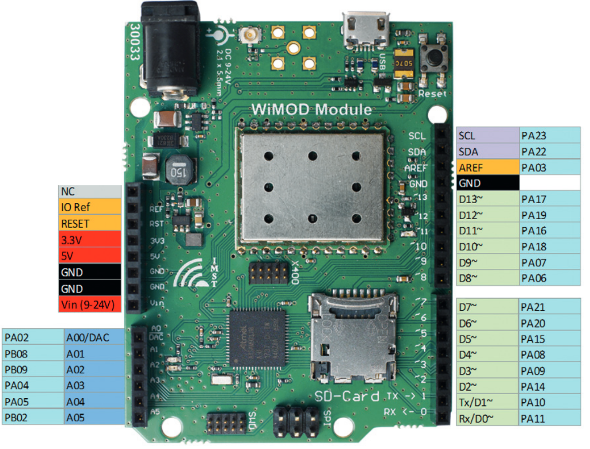
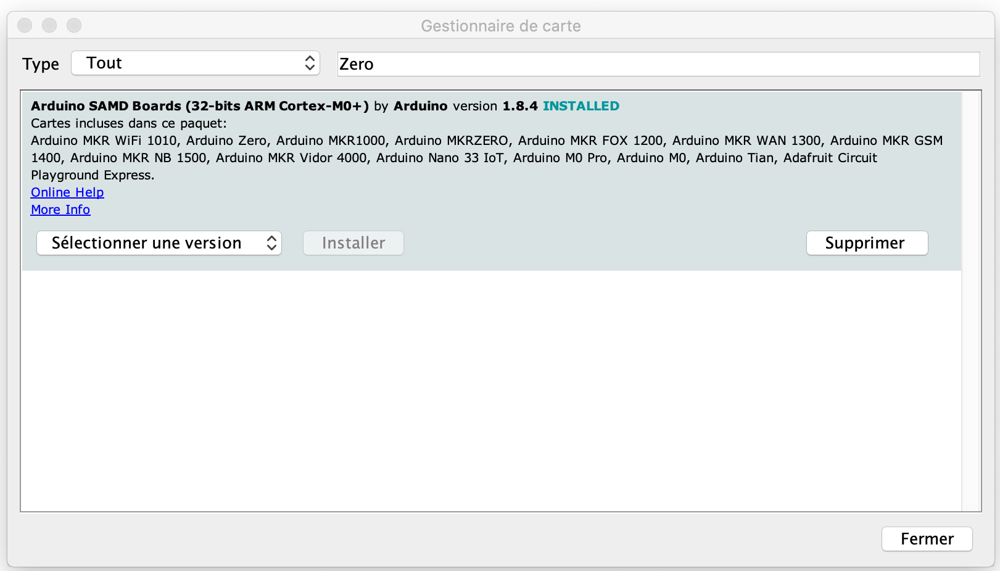

# CampusIoT :: WimoDino iM980a :: Tutoriel :fr:

## Objectif
L'objectif de ce tutoriel est de mettre en oeuvre un réseau de 2 cartes (ou plus) WimoDino iM980a communiquant en pair-à-pair au moyen de communication LoRa sur la bande 2.4GHz.

Si ce tutoriel vous est utile, pensez à donner une étoile :star: en haut à droit.

## LoRa 2.4GHz
TBC

TBC Semtech SX1280


## Carte d'évaluation IMST WimoDino iM980a

### Module IMST iM980a




* https://www.wireless-solutions.de/products/long-range-radio/im980a.html

    Frequency range: 	ISM Band 902 to 928 MHz
    Modulation: 	LoRa™ Spread-Spectrum
    RF output power: 	up to +17.5 dBm (50Ω pad)
    Receiver sensitivity: 	-137.5 dBm (SF 12;  SB 125 kHz, CR 4/6), -134 dBm (SF 12;  SB 250 kHz, CR 4/6), -128 dBm (SF 12;  SB 500 kHz, CR 4/6)
    RF datarate: 	0.980 to 12.5  kbps
    RF range: 	up to 15000 m (line of sight)
    Operating voltage: 	2.4 V to 3.6 V
    Current consumption: 	< 1.8 μA (module in sleep, RTC running)
    13 mA (Rx)
    122 mA (Tx @ 3.0 V/ +20 dBm)

### Carte compatible-Arduino WimoDino iM980a
TBC
* https://www.wireless-solutions.de/downloads/Evaluation-Tools/WiMODino/WiMODino_Datasheet_V1-0.pdf
* https://www.wireless-solutions.de/downloads/Evaluation-Tools/WiMODino/WiMODino_Flyer_V1-0.pdf


    Assembled with RED
    pre-certified LoRa®radio modules iM880B, iM282A, iM881A or iM980A
    Supports certified LoRaWAN® protocol stack
    Supports LR_Base (LoRa® protocol stack for P-2-P and P-2-Multi-P communication)
    RF range up to 15 km (LoS: Line of Sight)
    U.FL. connector for external antenna
    power supply external 9-24V DC or USB (micro)
    USB (micro), SPI, 2 USART, reset button, SD card holder, programming interfaces
    Compatible to ArduinoTM UNO R3  pinout  (3.3V)
    Powerful Cortex M0+  ATSAMD21J18  (256KB flash, 32KB SRAM)
        Interfaces SPIs, I²C, ADCs, UARTs, PWM channels, USB
        Timer Counters (8/16/32 bit), RTC, Watchdog Timer
        Debug support by non ArduinoTM IDEs


### LR-Base API

```
// LR-BASE API 
Ping( )
Reset( )
GetDeviceInfo( )
GetFirmwareInfo( )
GetSystemStatus( )
GetRtc( )
SetRtc( )
GetRadioConfig( )
SetRadioConfig( )
SetAesKey( )
GetAesKey( )
SendUData( )
SendCData( )
SetAckData( )
```


## Installation de l'IDE Arduino
TBC



* https://www.wireless-solutions.de/download/Evaluation-Tools/WiMODino/WiMOD-ArduinoLib-V1_5_0.zip
## Flashage du sketch Ping-Pong
TBC

```
// TBC
```


