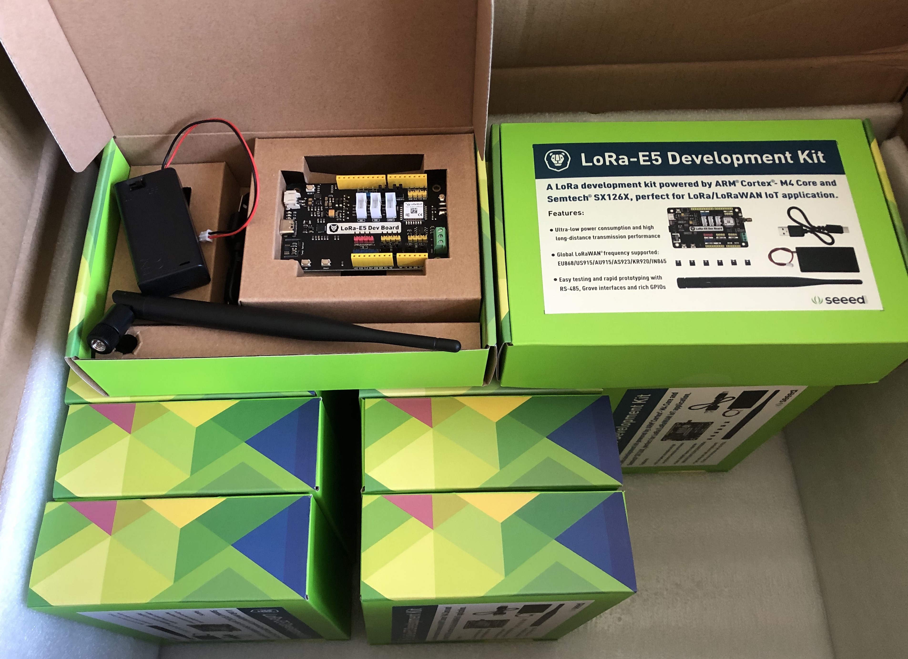

# Tutoriel avec les cartes Wio LoRa E5 de Seedstudio

Les cartes de développement Wio LoRa E5 contiennent un module intégrant un micro-contrôleur [STM32WLE5JC](https://www.st.com/resource/en/datasheet/stm32wle5c8.pdf).

Elles existent sous 3 formes:
* [LoRa E5 Mini](https://wiki.seeedstudio.com/LoRa_E5_mini/)
* [LoRa E5 Dev](https://wiki.seeedstudio.com/LoRa_E5_Dev_Board/)
* [Wio Grove E5](https://wiki.seeedstudio.com/Grove_LoRa_E5_New_Version/)

## Commandes AT

Les cartes sont livrées avec un firmware par défaut qui est un modem AT LoRa (PHY) / LoRaWAN 

[Specifications](https://files.seeedstudio.com/products/317990687/res/LoRa-E5%20AT%20Command%20Specification_V1.0%20.pdf)

## Développement

### STM32 Cube

https://my.st.com/content/my_st_com/en/products/embedded-software/mcu-mpu-embedded-software/stm32-embedded-software/stm32cube-mcu-mpu-packages/stm32cubewl.license=1608693595598.product=STM32CubeWL.version=1.0.0.html#overview

### RIOT OS

https://stm32python.gitlab.io/fr-version-lora/lora.html

## Misc

### Cases
* https://www.thingiverse.com/thing:5478136