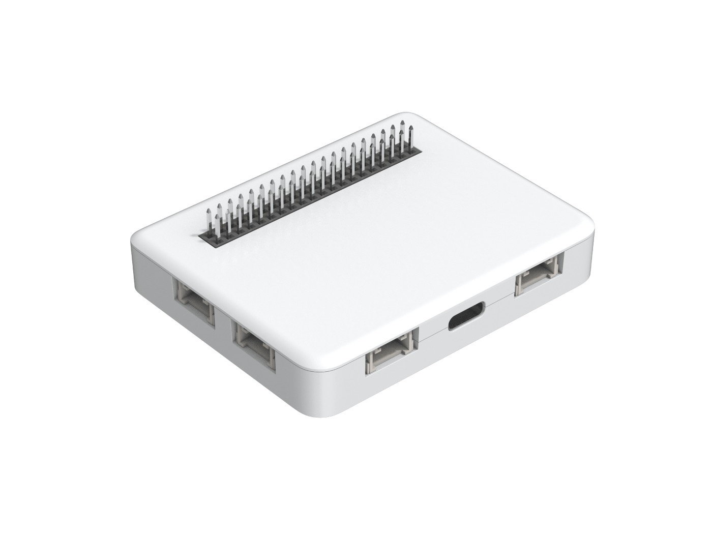
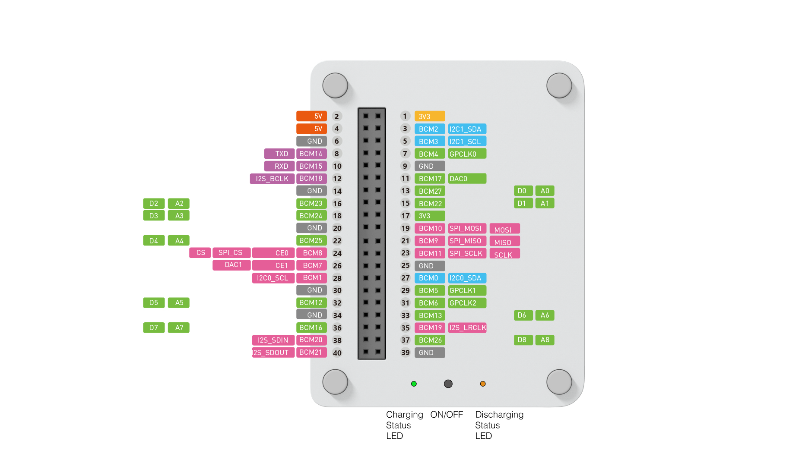

# Seeedstudio :: Wio Terminal :: Tutoriel 

Wio Terminal est une carte embarquée basse consommation d'énergie pour réaliser rapidement des démonstrateurs pour l'Internet des Objets.

Cette carte dispose de connecteurs Grove pour ajouter des platines Grove ainsi qu'un _header_ 40 broches compatible avec celui du Raspberry Pi 3.

Cette carte peut être équipée entre autre d'un modem LoRa ([Grove LoRa RFM95 868 MHz](https://wiki.seeedstudio.com/Grove_LoRa_Radio/)) ou modem LoRaWAN ([Grove - LoRa-E5](https://www.seeedstudio.com/Grove-LoRa-E5-STM32WLE5JC-p-4867.html)) pour communiquer des mesures relevées et analysées.

Cette carte peut être utilisée pour des démonstrateurs d'intelligence artificielle embarquée avec le canevas TinyML.

 

## Démarrage

* https://wiki.seeedstudio.com/Wio-Terminal-Getting-Started/

## Ecran LCD

TODO

Référence:
* https://wiki.seeedstudio.com/Wio-Terminal-LCD-Overview/
* https://github.com/Seeed-Studio/Seeed_Arduino_LvGL
* https://github.com/moononournation/Arduino_GFX
* [WioTerminal UncannyEyes](https://github.com/Seeed-Studio/Seeed_Arduino_Sketchbook/tree/master/examples/WioTerminal_UncannyEyes)

## Carte MicroSD

TODO

Référence: https://wiki.seeedstudio.com/Wio-Terminal-FS-Overview/

## Audio

### Microphone

* [Microphone](examples/Microphone)
* [Wio Audio Spectrum Display](examples/Wio_audio_spectrum_display)
* [Wio Terminal Sound Meter](https://wiki.seeedstudio.com/Wio-Terminal-Sound-Meter/)

### Buzzer

TODO

Référence: https://wiki.seeedstudio.com/Wio-Terminal-Buzzer/

### Haut parleur

TODO

Référence: https://wiki.seeedstudio.com/Wio-Terminal-Audio-GUI/

## RTC

TODO

Référence:  https://wiki.seeedstudio.com/Wio-Terminal-RTC/

## IMU

TODO

* [Rolling Ball Maze Game](./examples/RollingBallMaze)
* [Level](https://github.com/Seeed-Studio/Seeed_Arduino_Sketchbook/tree/master/examples/WioTerminal_Level)
* [Attitude Indicator](https://github.com/Seeed-Studio/Seeed_Arduino_Sketchbook/blob/master/examples/WioTerminal_AttitudeIndicator/WioTerminal_AttitudeIndicator.ino) [local](./examples/Attitude)

Référence: https://wiki.seeedstudio.com/Wio-Terminal-IMU-Basic/

Avec [TinyML](https://makergram.com/blog/play-chromes-dino-game-physically/?fbclid=IwAR3h19XxXITb4jh6Ot1pvc7yDXJ5g8gvNAOPA7DYTs8rpQ1DaiHmd_WsGFo)

## Emetteur InfraRouge (IR)

TODO

* https://wiki.seeedstudio.com/Wio-Terminal-Infrared-Emitter/
* https://github.com/Arduino-IRremote/Arduino-IRremote : Supported IR Protocols : Denon / Sharp, JVC, LG, NEC / Onkyo / Apple, Panasonic / Kaseikyo, Philips RC5, Philips RC6, Samsung, Sony, (Pronto), BoseWave, Lego, Whynter and optional MagiQuest.

## Platines Grove

Le catalogue de Seeedstudio comporte dans son [catalogue](https://wiki.seeedstudio.com/Grove/) plusieurs dizaines de platines Grove démontrant les capteurs et les actionneurs les plus courants de s principaux fabricants.

### Météo

* [Grove High Precision Pressure Sensor DPS310](https://wiki.seeedstudio.com/Barometric-Pressure-sensor-using-the-Wio-terminal/)

### Qualité de l'air

Le catalogue de Seeedstudio comporte plusieurs platines Grove pour la mesure de gaz dans son [catalogue](https://wiki.seeedstudio.com/Sensor_gas/).

* [Grove - Gas Sensor V2 (Multichannel](./examples/GroveMultiChannelGasSensor_Wio)
* [Grove CO2 & Temperature & Humidity Sensor SCD41](./examples/GroveCO2TemperatureHumiditySensorSCD41)

### Qualité de l'eau

* [Grove - Turbidity Sensor Meter for Arduino V1.0](./examples/GroveTurbiditySensorMeter)

### Vision

* [Capture d'images avec une camera](https://github.com/microsoft/IoT-For-Beginners/blob/main/4-manufacturing/lessons/2-check-fruit-from-device/wio-terminal-camera.md)

### Infrared Vision

* [Grove - Infrared Temperature Sensor Array (AMG8833)](./examples/GroveInfraredTemperatureSensorArrayAMG8833)
* Melexis [MLX90640](./MLX90640) : 32x24 array of thermopile sensors with 110° and 55° FOV

### GPS

* [Grove GPS](https://github.com/Seeed-Studio/Seeed_Arduino_Sketchbook/tree/master/examples/WioTerminal_GPS)

## Adaptateurs Mikrobus

Le header femelle 40 broches du Wio Terminal est compatible avec celui du Raspberry Pi 3.

Il est possible de brancher des cartes pour Raspberry Pi 3 comme ce [support pour cartes Mikrobus](https://www.mikroe.com/pi-3-click-shield) afin d'utiliser les [adaptateurs de l'écosystème Mikrobus](https://www.mikroe.com/).

TODO

## WiFi

TODO

## BLE

TODO

Référence: https://wiki.seeedstudio.com/Wio-Terminal-Bluetooth-Overview/

## MQTT

TODO

## LoRaWAN avec LoRa E5

* https://wiki.seeedstudio.com/Grove_LoRa_E5_New_Version/
* https://github.com/disk91/WioLoRaWANFieldTester

TODO

## LoRa 2.4 GHz avec SX1280

TODO

## MicroPython (ArduPy)

TODO

* https://micropython.org/download/SEEED_WIO_TERMINAL/
* https://wiki.seeedstudio.com/ArduPy/
* [Playing Snake](https://www.hackster.io/ansonhe1997/playing-snakes-on-seeed-wio-terminal-9659d7)
## FreeRTOS

TODO

## RIOT OS

TODO

## Machine Learning

### TinyML

_Qu'est-ce que [TinyML](https://www.tinyml.org/) ? ML, comme vous l'avez peut-être deviné, signifie Machine Learning et, dans la plupart des cas (pas toujours cependant), fait aujourd'hui référence à Deep Learning. Tiny dans TinyML signifie que les modèles ML sont optimisés pour fonctionner sur des appareils à très faible consommation d'énergie et à faible encombrement, tels que divers microcontrôleurs. Il s'agit d'un sous-ensemble de ML on the Edge ou Embedded Machine Learning. (traduit de https://www.seeedstudio.com/wio-terminal-tinyml.html)_

TODO

* https://www.seeedstudio.com/wio-terminal-tinyml.html
* [Artificial Nose](https://blog.benjamin-cabe.com/tag/tinyml)
* [Audio Scene Recognition](https://github.com/Seeed-Studio/Seeed_Arduino_Sketchbook/tree/master/examples/WioTerminal_TinyML_2_Audio_Scene_Recognition)
* [Speech Recognition](https://github.com/Seeed-Studio/Seeed_Arduino_Sketchbook/tree/master/examples/WioTerminal_TinyML_6_Speech_Recognition)
* [IMU Anomaly Detection](https://github.com/Seeed-Studio/Seeed_Arduino_Sketchbook/tree/master/examples/WioTerminal_TinyML_5_Anomaly_Detection)
* [TinyML Benchmark](https://github.com/bharathsudharsan/TinyML-Benchmark-NNs-on-MCUs)

### Edge Impluse

_[Edge Impulse](https://www.edgeimpulse.com/) est la principale plate-forme de développement pour l'apprentissage automatique sur les appareils périphériques, gratuite pour les développeurs et approuvée par les entreprises._

https://wiki.seeedstudio.com/Wio-Terminal-TinyML-EI-1/

### TensorFlow Lite

* https://github.com/Seeed-Studio/Seeed_Arduino_Sketchbook/tree/master/examples/WioTerminal_TF_MNIST

## Pinout

## Wio Terminal Battery Chassis

https://wiki.seeedstudio.com/Wio-Terminal-Battery-Chassis/

## Misc
* Le cours de Seeestudio https://github.com/lakshanthad/Wio_Terminal_Classroom_Arduino
* [Seeed Arduino Sketchbook](https://github.com/Seeed-Studio/Seeed_Arduino_Sketchbook/tree/master/examples)
* Un cours complet IoT utilisant le Wio Terminal https://github.com/microsoft/IoT-For-Beginners
* [hackster.io projects with Wio Terminal](https://www.hackster.io/search?q=Wio%20Terminal&i=projects)