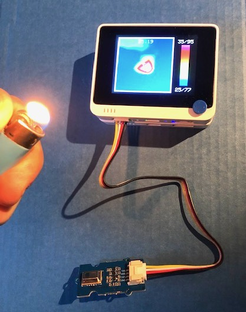

# Wio Terminal et Grove - Infrared Temperature Sensor Array (AMG8833)

La platine [Grove - Infrared Temperature Sensor Array (AMG8833)](https://wiki.seeedstudio.com/Grove-Infrared_Temperature_Sensor_Array-AMG8833/) est équipé du capteur thermique 8x8 [Panasonic AMG8833](https://industry.panasonic.eu/components/sensors/industrial-sensors/grid-eye/amg88xx-high-performance-type/amg8833-amg8833). Il est aussi appelé _Grid Eye_.

Les applications sont nombreuses : par exemple, la mesure de température (visualisation de pont thermique dans un batiment) ou de la mesure d'occupation dans une pièce.

Suivez les [instructions](https://wiki.seeedstudio.com/Wio-Terminal-Thermal-Camera/) pour l'installation des bibliothèques pour le Wio Terminal.

Installez la bibliothèque [Seeed_Arduino_LCD](https://wiki.seeedstudio.com/Wio-Terminal-LCD-Overview/) si ce n'est pas déjà fait.

Chargez l'exemple de test sur le Wio Terminal.

Faites quelques tests des _choses_ chaudes et froides comme la flamme d'un briquet, votre visage, une tasse de café, une canette de soda glacée ...

## Pour aller plus loin
* https://www.hackster.io/mithun-das/ai-powered-thermal-camera-for-safe-camping-8fc887
* https://www.hackster.io/naveenbskumar/no-pause-f1bcbf
