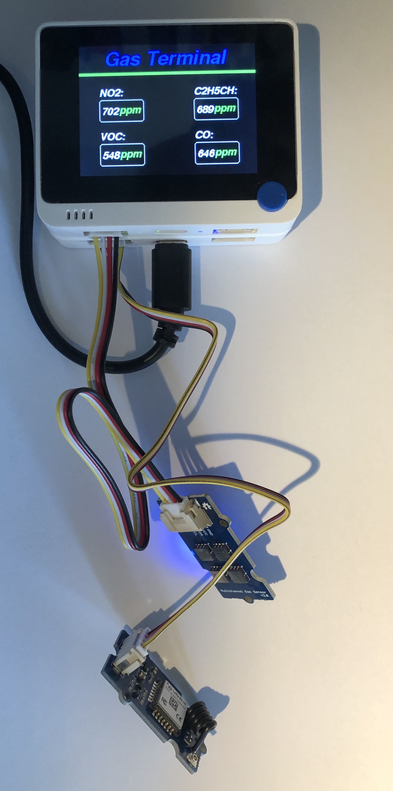

# Wio Terminal, Grove LoRa E5 et Grove - Gas Sensor V2 (Multichannel)

La platine [Grove - Gas Sensor V2(Multichannel)](https://wiki.seeedstudio.com/Grove-Multichannel-Gas-Sensor-V2/) détecte plusieurs variétés de gaz incluant Carbon monoxide (CO), Nitrogen dioxide (NO2), Ethyl alcohol(C2H5CH), Volatile Organic Compounds (VOC) ... au moyen des composants [GM-102B, GM-302B, GM-502B et GM-702B](https://www.cnwinsen.com/products/MEMS-sensor).

Suivez les instructions pour l'installation des bibliothèques.

Installez la bibliothèque [Seeed_Arduino_LCD](https://wiki.seeedstudio.com/Wio-Terminal-LCD-Overview/) si ce n'est pas déjà fait.

Branchez la [platine Grove LoRa E5](https://wiki.seeedstudio.com/Grove_LoRa_E5_New_Version/) (qui est un modem LoRaWAN) sur le connecteur Grove UART du Wio Terminal Battery Chassis.

Chargez l'exemple de test sur le Wio Terminal.

Repérez et relevez le `DevEUI`, l'`AppEUI` et l'`AppKey` de la [platine Grove LoRa E5](https://wiki.seeedstudio.com/Grove_LoRa_E5_New_Version/) dans la console série du Wio Terminal.

Enregistrez le WioTerminal sur un réseau LoRaWAN ([TTN](https://console.cloud.thethings.network/), [Helium](https://console.helium.com/) ou Chirpstack) en utilisant le `DevEUI`, l'`AppEUI` et l'`AppKey` relevés.

> Vous pouvez changer les valeurs d'`AppEUI` et d'`AppKey` dans le croquis.

Ajoutez ce décodeur lors de l'enregistrement de Wio Terminal sur le réseau LoRaWAN choisi:

```javascript
function readInt16BE (buf, offset) {
    offset = offset >>> 0
    var val = buf[offset + 1] | (buf[offset] << 8)
    return (val & 0x8000) ? val | 0xFFFF0000 : val
  }

// For Helium et TTNv2
function Decode(fPort, bytes, variables) {
    var o = {};  
    o.co = readInt16BE(bytes,0);
    o.c2h5ch = readInt16BE(bytes,2);
    o.no2 = readInt16BE(bytes,4);
    o.voc = readInt16BE(bytes,6);
    
    return o;
}

// For Helium et TTNv2
function Decoder(bytes, fPort) {
    return Decode(fPort, bytes, undefined);
}

// For  TTNv3 TODO

```

> Pour Helium, il faut [créer une nouvelle fonction](https://console.helium.com/functions).

Faites quelques tests dans des produits comme du gaz de briquet, du CO émis par une bougie piègée dans un bocal ...

Regardez les messages LoRaWAN envoyés par le Wio Terminal lorsque la procédure d'activation OTAA a réussi.



## Améliorations

* [ ] Ajouter le status de connectivité LoRaWAN (join) à l'écran
* [ ] Transmettre la [tension de la batterie du chassis](../LiPoBatteryStatus/).
* [ ] Eteindre l'écran après 30 secondes pour économiser la batterie.
* [ ] Arrêter de relever les mesures quand l'écran est éteint.
