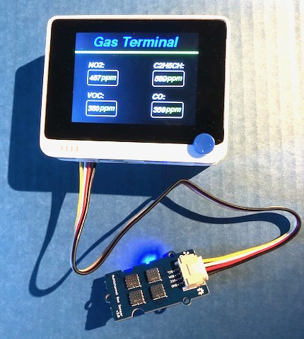

# Wio Terminal et Grove - Gas Sensor V2 (Multichannel)

La platine [Grove - Gas Sensor V2(Multichannel)](https://wiki.seeedstudio.com/Grove-Multichannel-Gas-Sensor-V2/) détecte plusieurs variétés de gaz incluant Carbon monoxide (CO), Nitrogen dioxide (NO2), Ethyl alcohol(C2H5CH), Volatile Organic Compounds (VOC) ... au moyen des composants [GM-102B, GM-302B, GM-502B et GM-702B](https://www.cnwinsen.com/products/MEMS-sensor).

Suivez les instructions pour l'installation des bibliothèques.

Installez la bibliothèque [Seeed_Arduino_LCD](https://wiki.seeedstudio.com/Wio-Terminal-LCD-Overview/) si ce n'est pas déjà fait.

Chargez l'exemple de test sur le Wio Terminal.

Faites quelques tests dans des produits comme du gaz de briquet, du CO emis par une bougie piègée dans un bocal ...

## Plus aller plus loin
* [Le Nez Artificiel de Benjamin Cabé](https://blog.benjamin-cabe.com/2021/08/03/how-i-built-a-connected-artificial-nose)
