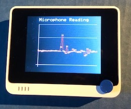

# Microphone

Wio Microphone comporte un microphone intégré branché sur la broche analogique `WIO_MIC`.

Suivez les instructions pour la démonstration https://wiki.seeedstudio.com/Wio-Terminal-Mic/

