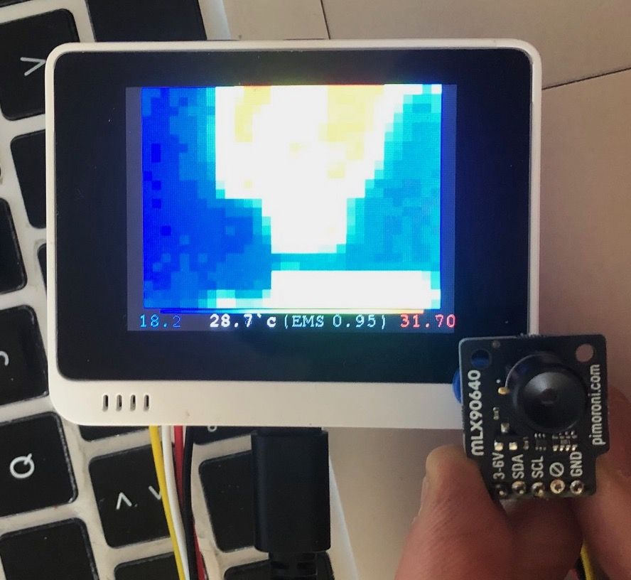

# Wio Terminal with I2C MLX90640 Thermal Sensor

From https://github.com/okini3939/wio_thermal

- Thermal Imaging Camera
  - https://www.seeedstudio.com/Grove-Thermal-Imaging-Camera-IR-Array-MLX90640-110-degree-p-4334.html
  - or https://m5stack-store.myshopify.com/collections/m5-unit/products/thermal-camera

- for Arduino IDE
  - Board: Seeeduino Wio Terminal
  - Library: https://github.com/Seeed-Studio/Seeed_Arduino_MLX9064x
  - Example: https://github.com/m5stack/M5Stack/tree/master/examples/Unit/THERMAL_MLX90640

## Memo

- Button A: Point to highest temperature  
- Button B: Point to screen center
- Button C: Point to lowest temperature 
- 5way Up: EMS +0.1
- 5way Down: EMS -0.1

## TODO

- Save current thermal image (BMP format) to SDCard
