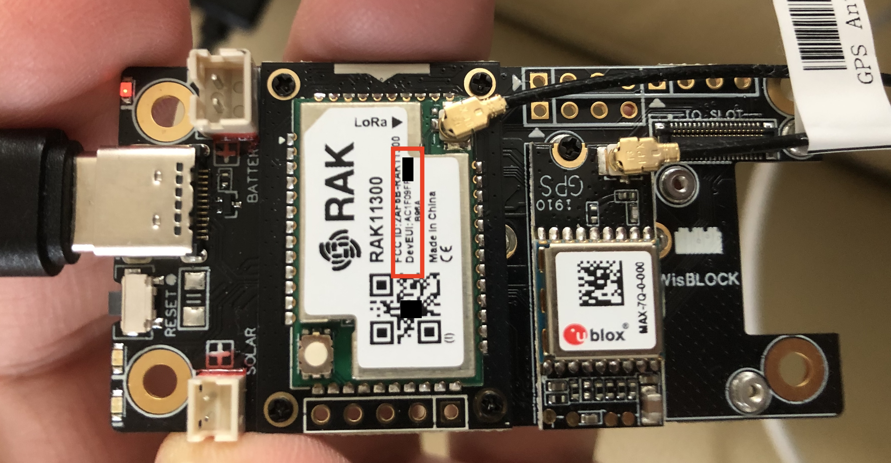

# RAK Wireless WisBlock LPWAN

RAK Wireless WisBlock LPWAN est une plateforme IoT modulaire et empilable conçue pour fournir une connectivité réseau à longue portée et faible consommation d'énergie (LPWAN) pour diverses applications IoT. LPWAN est un type de technologie de réseau sans fil qui permet une communication à longue portée avec une faible consommation d'énergie, ce qui en fait la solution idéale pour les appareils IoT nécessitant une faible consommation d'énergie et une longue durée de vie de la batterie.

La plateforme WisBlock se compose de différents modules qui peuvent être empilés pour construire un appareil IoT personnalisé. Elle utilise un format standardisé, ce qui permet un prototypage et un déploiement faciles et rapides d'applications IoT.

La plateforme WisBlock prend en charge diverses technologies LPWAN telles que LoRaWAN, NB-IoT et LTE-M, la rendant polyvalente et adaptée à divers cas d'utilisation. De plus, elle intègre une unité de microcontrôleur (MCU) puissante et divers capteurs, en faisant un appareil IoT entièrement fonctionnel dès sa sortie de la boîte.

La plateforme RAK Wireless WisBlock LPWAN est conçue pour permettre aux développeurs IoT de créer et déployer rapidement et facilement des solutions IoT à longue portée et faible consommation d'énergie.

## La configuration pour le suiveur de ballons stratosphériques

* [RAK11310 : Raspberry Pi RP2040 Core Module for LoRaWAN with LoRa SX1262 for eu868 band](https://store.rakwireless.com/products/rak11310-wisblock-lpwan-module?variant=40830755471558)
* [RAK19007 : WisBlock Base Board 2nd Gen](https://store.rakwireless.com/products/rak19007-wisblock-base-board-2nd-gen)
* [RAK1910 : GNSS GPS Location Module u-Blox MAX-7Q](https://store.rakwireless.com/products/rak1910-max-7q-gnss-location-sensor)
* [GNSS antenna](https://store.rakwireless.com/products/gps-antenna-27db)
* [Battery Connector Cable](https://store.rakwireless.com/products/battery-connector-cable)
* [Solar Panel Connector Cable](https://store.rakwireless.com/products/solar-panel-connector-cable)

En option
* [RAK1906 Environment Sensor BOSCH BME680](https://docs.rakwireless.com/Product-Categories/WisBlock/RAK1906/Quickstart/)
* [RAK1904 WisBlock 3-Axis Acceleration Sensor Module](https://docs.rakwireless.com/Product-Categories/WisBlock/RAK1904)


## Getting started

https://docs.rakwireless.com/Product-Categories/WisBlock/RAK11310/Quickstart/#prerequisites

https://docs.rakwireless.com/Product-Categories/WisBlock/Quickstart/#description

## Montage de la carte WisBlock

Montage du [RAK11310](https://docs.rakwireless.com/Product-Categories/WisBlock/RAK11310/Quickstart/#hardware-setup)

Montage du [RAK1910](https://docs.rakwireless.com/Product-Categories/WisBlock/RAK1910/Quickstart/#hardware-setup)

Montage [de la batterie LiPo et du panneau solaire](https://docs.rakwireless.com/Product-Categories/WisBlock/RAK11310/Quickstart/#battery-and-solar-connection)




## Configuration de l'IDE Arduino

https://docs.rakwireless.com/Knowledge-Hub/Learn/Installation-of-Board-Support-Package-in-Arduino-IDE/

Copy this URL https://raw.githubusercontent.com/RAKwireless/RAKwireless-Arduino-BSP-Index/main/package_rakwireless_index.json and paste it on the field as shown in Figure 11. If there are other URLs already there, just add it on the next line. After adding the URL, click OK.


## Chargement d'un firmware

Le module RAK11300 doit être mis dans un état particulier pour charger un nouveau firmware.

Maintenez appuyé le bouton `bootselect` du module RAK11300 puis maintenez appuyé le bouton `reset` de la carte Wisblock pendant 2 secondes au moins; Relachez les 2 boutons. Le volume `RPI_RP2` est monté dans le système de fichiers.

> Les firmwares pour le module RAK11300 sont au [format `.uf2`](https://github.com/microsoft/uf2). Ils peuvent être copiés dans le volume `RPI_RP2` pour le chargement d'un nouveau firmware.

## Upgrading the Firmware `RAK11300-AT-Command-Firmware`

https://docs.rakwireless.com/Product-Categories/WisBlock/RAK11310/Quickstart/#upgrading-the-firmware

https://github.com/RAKWireless/RAK11300-AT-Command-Firmware/tree/main

https://github.com/RAKWireless/RAK11300-AT-Command-Firmware/blob/main/AT-Command.md

Baud rate is 115200

## Communication LoRaWAN

Choisissez le croquis d'exemple  `File > Examples > RAK WisBlock Examples > RAK11300 > Communications > LoRa > LoRaWAN > LoRaWAN_OTAA_ABP`

Cliquez sur le lien et `http://librarymanager/All#SX126x` et choisissez la library https://github.com/beegee-tokyo/SX126x-Arduino/

```console
OTAA join failed!
Check your EUI's and Keys's!
Check if a Gateway is in range!
=====================================
Welcome to RAK11300 LoRaWan!!!
Type: OTAA
Region: EU868
=====================================
OTAA Mode, Network Joined!
Sending frame now...
```

[Le croquis](https://github.com/RAKWireless/WisBlock/blob/master/examples/RAK11300/communications/LoRa/LoRaWAN/LoRaWAN_OTAA_ABP/LoRaWAN_OTAA_ABP.ino)

> A noter: dans l'image ci-dessus, un `DevEUI` commençant par l'`OUI` (`AC:1F:09`) de RAK Wireless est inscrit sur l'étiquette du module (ainsi qu'un QRCode). Vous pouvez utiliser cette valeur de `DevEUI` pour changer les valeurs de la variable `nodeDeviceEUI` et en profiter pour changer la valeur de la variable `nodeAppKey` qui contient la clé secrète `AppKey` de l'équipement. 


## Communication LoRaP2P

[Les croquis](https://github.com/RAKWireless/WisBlock/tree/master/examples/RAK11300/communications/LoRa/LoRaP2P)

### LoRaP2P_TX

Choisissez le croquis d'exemple  `File > Examples > RAK WisBlock Examples > RAK11300 > Communications > LoRa > LoRaP2P > LoRaP2P_TX`

[Le croquis]()

### LoRaP2P_RX

Choisissez le croquis d'exemple  `File > Examples > RAK WisBlock Examples > RAK11300 > Communications > LoRa > LoRaP2P > LoRaP2P_RX`

[Le croquis]()

## Communication WiFi AP

Choisissez le croquis d'exemple  `File > Examples > RAK WisBlock Examples > RAK11300 > Communications > WiFi > connect_ap`

[Le croquis]()

## Lecture du niveau de batterie

Ajoutez la bibliothèque https://github.com/olikraus/u8g2 

Choisissez le croquis d'exemple  `File > Examples > RAK WisBlock Examples > RAK11300 > Power > RAK11300 Battery Level Detect`


[Le croquis]()

## Geolocalisation GNSS

Branchez le module [RAK1910 : GNSS GPS Location Module u-Blox MAX-7Q](https://store.rakwireless.com/products/rak1910-max-7q-gnss-location-sensor) Altitude max : 50,000 m

Choisissez le croquis d'exemple  `File > Examples > RAK WisBlock Examples > RAK11300 > Sensors > RAK1910_GPS_UBLOX7`

[Le croquis](https://github.com/RAKWireless/WisBlock/tree/master/examples/common/sensors/RAK1910_GPS_UBLOX7)


```
GPS uart init ok!
 CHARS=179 SENTENCES=0 CSUM ERR=0
 CHARS=356 SENTENCES=0 CSUM ERR=0
 ...
(N):LAT=48.985922 (E):LON=2.327283 SAT=5 PREC=277 CHARS=60361 SENTENCES=134 CSUM ERR=0
(N):LAT=48.985918 (E):LON=2.327282 SAT=5 PREC=277 CHARS=60768 SENTENCES=136 CSUM ERR=0
(N):LAT=48.985914 (E):LON=2.327275 SAT=5 PREC=277 CHARS=61175 SENTENCES=138 CSUM ERR=0

```

## RTC

## SD Card


## [RAK1906 Environment Sensor BOSCH BME680](https://docs.rakwireless.com/Product-Categories/WisBlock/RAK1906/Quickstart/)

## [RAK1904 WisBlock 3-Axis Acceleration Sensor Module](https://docs.rakwireless.com/Product-Categories/WisBlock/RAK1904)

## LoRaWAN GPS Tracker

Modifiez le croquis suivant pour le module RAK11300
https://github.com/RAKWireless/WisBlock/tree/master/examples/RAK4630/solutions/GPS_Tracker


https://docs.rakwireless.com/Product-Categories/WisBlock/RAK1910/Quickstart/#payload-decoding-of-lorawan-gps-tracker

```javascript
function Decode(fport, bytes)
{
  var longitude_int, latitude_int;
  var decoded = {"latitude":"","longitude":""};

  if (fport === 2) {
    if(bytes[0]==9) // check if the header byte is 9.
    {
      latitude_int = (bytes[1] << 24) | (bytes[2] << 16) | (bytes[3] << 8) | (bytes[4]);
      decoded.latitude = latitude_int / 100000;
      longitude_int = (bytes[6] << 24) | (bytes[7] << 16) | (bytes[8] << 8) | (bytes[9]);
      decoded.longitude = longitude_int / 100000;
      return decoded;
    }
  }
}
```

## Helium Mapper

[Make a Helium Mapper with the WisBlock](https://news.rakwireless.com/make-a-helium-mapper-with-the-wisblock/)

## Exercice

Assemblez les exemples ci-dessus pour transmettre en LoRaWAN ABP la position GNSS et les valeurs environementales ([RAK1906](https://docs.rakwireless.com/Product-Categories/WisBlock/RAK1906/Quickstart/)) ainsi que le niveau de batterie.

Faites varier la taille des messages, le DR et le TxPower périodiquement.

Utilisez le [capacité de LNS](https://resources.lora-alliance.org/technical-specifications/lorawan-application-layer-clock-synchronization-specification-v1-0-0) pour synchroniser/régler l'horloge RTC de la MCU.

Si le module SD Card est installé, journalisez la position GNSS et le niveau de batterie dans un fichier de la SD Card.

Inspirez-vous de [Orbimote FTD](https://github.com/CampusIoT/orbimote/tree/master/field_test_device).
