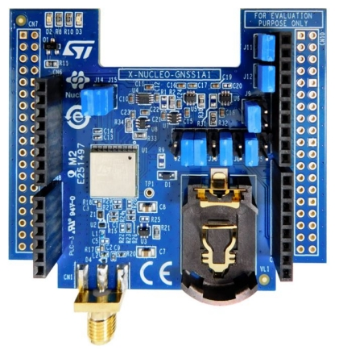

# X-NUCLEO-GNSS1A1 GNSS expansion board based on Teseo-LIV3F module for STM32 Nucleo

## TODO
* [ ] Jumpers setting
* [ ] Example with RIOT OS : show lat, lon, alt, time (set RTC) ...

## Manuels
* [Quick start](https://www.st.com/content/ccc/resource/sales_and_marketing/presentation/product_presentation/group0/7e/1f/bf/fe/ee/aa/4d/e2/X-NUCLEO-GNSS1A1_Quick_Start_Guide/files/x-nucleo-gnss1a1_quick_start_guide.pdf/jcr:content/translations/en.x-nucleo-gnss1a1_quick_start_guide.pdf)
* [Getting started with Linux](https://www.st.com/resource/en/user_manual/um2909-getting-started-with-xlinuxgnss1-package-for-developing-gnss-applications-on-linux-os-stmicroelectronics.pdf)
* [Getting started with Nucleo](https://www.st.com/resource/en/user_manual/um2327-getting-started-with-the-xnucleognss1a1-expansion-board-based-on-teseoliv3f-tiny-gnss-module-for-stm32-nucleo-stmicroelectronics.pdf)

## Conception
* [Schematic](https://www.st.com/content/ccc/resource/technical/layouts_and_diagrams/schematic_pack/group0/fc/a6/aa/6c/3b/2e/4c/e8/X-NUCLEO-GNSS1A1_schematics/files/x-nucleo-gnss1a1_schematic.pdf/jcr:content/translations/en.x-nucleo-gnss1a1_schematic.pdf)
* [BOM](https://www.st.com/content/ccc/resource/technical/document/bill_of_materials/group0/c8/cf/c2/7d/48/ce/40/43/X-NUCLEO-GNSS1A1_BOM/files/x-nucleo-gnss1a1_bom.pdf/jcr:content/translations/en.x-nucleo-gnss1a1_bom.pdf)
* [Gerber](https://www.st.com/content/ccc/resource/technical/layouts_and_diagrams/board_manufacturing_specification/group0/1e/d4/52/2e/2b/6f/4e/a4/X-NUCLEO-GNSS1A1_gerber_files/files/x-nucleo-gnss1a1_gerber.zip/jcr:content/translations/en.x-nucleo-gnss1a1_gerber.zip)