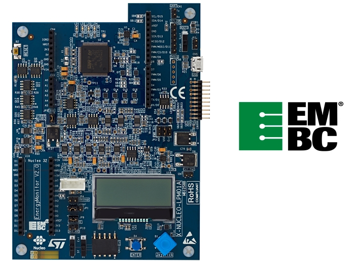

# X-NUCLEO-LPM01A Power Shield :: Tutoriel

## Introduction

La carte [X-NUCLEO-LPM01A](https://www.st.com/en/evaluation-tools/x-nucleo-lpm01a.html) permet de surveiller la consommation de cartes embarquées.

Elle est faite pour alimenter et monitorer la consommation des cartes STM32 Nucleo 32,64 et 144. Elle est utilisable avec toutes les cartes des autres constructeurs (avec pinout Arduino ou Arduino Nano ou autre).

Elle est utilisable avec l’environnement de ST (via un port série) ou en standalone.

ST fournit le firmware du benchmark [ULPBench](https://www.eembc.org/ulpmark/) pour ses cartes.

## Mesure de la consommation d'une carte Nucleo en mode standalone

A rédiger

[Voir rapport projet d'évaluation des modes _low power_ des Nucleo](projet_eval_nucleo_low_power_2019/rapport_nucleo_lowpower.pdf) et [voir les sources](projet_eval_nucleo_low_power_2019/src).

## Mesure de la consommation d'une carte Nucleo avec l'outil STM32CubeMonitor-Power

A rédiger

[Voir rapport projet d'évaluation des modes _low power_ des Nucleo](projet_eval_nucleo_low_power_2019/rapport_nucleo_lowpower.pdf) et [voir les sources](projet_eval_nucleo_low_power_2019/src).

## Références
* [Rapport projet d'évaluation des modes _low power_ des Nucleo (2019)](projet_eval_nucleo_low_power_2019/rapport_nucleo_lowpower.pdf). [Sources du projet](projet_eval_nucleo_low_power_2019/src).
* [UM2243 User manual STM32 Nucleo expansion board for power consumption measurement](https://www.st.com/resource/en/user_manual/dm00406577-stm32-nucleo-expansion-board-for-power-consumption-measurement-stmicroelectronics.pdf)
* [UM2202 STM32CubeMonitor-Power software tool for power and ultra-low-power measurements](https://www.st.com/resource/en/user_manual/dm00386264-stm32cubemonitorpower-software-tool-for-power-and-ultralowpower-measurements-stmicroelectronics.pdf)

