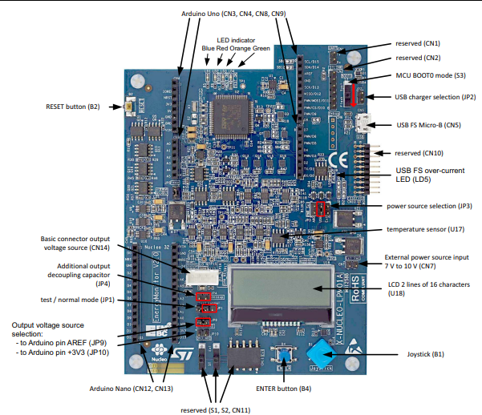
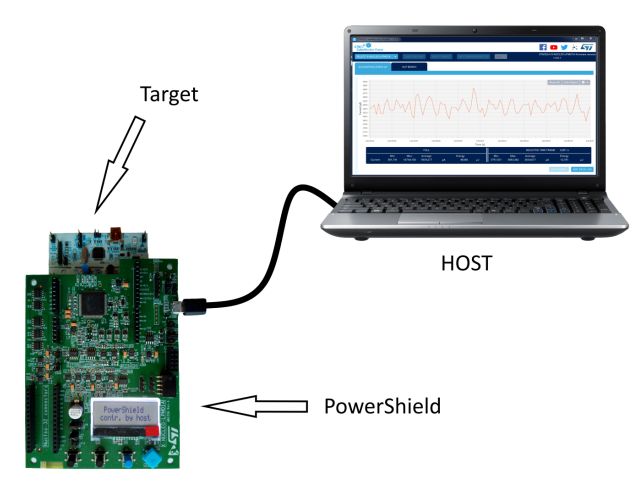

## Notes sur le Power Shield X-NUCLEO-LPM01A

 STM32 Power shield, Nucleo expansion board for power consumption measurement (UM2243) 
 https://www.st.com/en/evaluation-tools/x-nucleo-lpm01a.html
 
 
 The X-NUCLEO-LPM01A is a 1.8 V to 3.3 V programmable power supply source with advanced power consumption measurement capability. 
 
 https://www.st.com/en/evaluation-tools/x-nucleo-lpm01a.html
 
 
 ## Getting started with STM32 Nucleo Power shield

# YouTube tutorial:

https://www.youtube.com/watch?v=IB6_K88yWGU

# Nucleo Power Shield:
The STM32 Nucleo Power Shield performs consumption averaging (static measurement from 1 nA to 200 mA) as well as real-time analysis (dynamic measurement from 100 nA to 50 mA with 100 kHz bandwidth). It has a programmable voltage source from 1.8 V to 3.3 V.

# Download and Install STM32CubeMonPwr
[STM32CubeMonitor-Power (STM32CubeMonPwr)](https://my.st.com/content/my_st_com/en/products/development-tools/software-development-tools/stm32-software-development-tools/stm32-performance-and-debuggers/stm32cubemonpwr.license=1616419781144.product=CubeMonPwr-Mac.version=1.1.1.html) enables developers to swiftly analyze the low-power performance of target boards.

# Embedded software
The X-NUCLEO-LPM01A expansion board firmware is preloaded.

The latest firmware version (STM32-LPM01-XN): www.st.com/stm32softwaretools

# LED information
LED green (LD4): Acquisition ongoing

LED orange (LD3): Power supply to target board (in controlled by host mode, the board can remain supplied when the acquisition is completed)

LED blue (LD1): Current measured above defined threshold

LED red (LD2): Error

# Jumper JP1
For measurements, jumper JP1 should be always in the ‘normal’, and not in the ‘test’ position. Otherwise it may impact the current measurements results

# Adaptation to power via the AREF pin

The STM32 Nucleo64 or Nucleo144 target board should be adapted to be powered via the AREF pin of the Arduino Uno connector (CN3 pin8) 
prior to connection to the X-NUCLEOLPM01A. This adaptation is needed to power supply the STM32 MCU only, so that only the MCU consumption is measured. 
In other words, this adaptation removes the consumption of peripherals such as ST-LINK.

**How to adapt an STM32L432 Nucleo-32 to power the MCU from the Arduino AREF pin**

This example refers to the NUCLEO-L432KC schematics (MB1180) available from the www.st.com/stm32nucleo web page:
1. Remove jumper JP1: disconnect VDD from +3V3 power source
2. Open SB9: T_NRST reset MCU from ST-LINK
3. Open SB4 and SB17: MCO clock from ST-LINK to MCU (set HSI or use external crystal as MCU clock reference)
4. Open SB2: STLINK_RX of Virtual COM port
5. Open SB3: STLINK_TX of Virtual COM port.

Note: SWCLK and SWDIO cannot be disconnected. STM32L432 software should set these two signals (PA14 and PA13 respectively) to high impedance.

**How to adapt an STM32L476 Nucleo-64 to power the MCU from the Arduino AREF pin**

This example is refers to NUCLEO-L476RG schematics (MB1136) available from the www.st.com/stm32nucleo web page:
1. Remove jumper JP6: disconnect VDD from +3V3 power source
2. Remove jumper JP5: +5V power source selection; to disconnect +5 V from E5V and U5V
3. Open SB13: STLINK_RX of Virtual COM port
4. Open SB14: STLINK_TX of Virtual COM port
5. Open SB16: MCO clock from ST-LINK to MCU (set HSI or use external crystal as MCU clock reference)
6. Remove jumper CN2_1-2: SWCLK from ST-LINK to MCU
7. Remove jumper CN2_3-4: SWDIO from ST-LINK to MCU
8. Open SB15: SWO from ST-LINK to MCU
9. Open SB12: NRST from ST-LINK to MCU.

**How to adapt an STM32L496 Nucleo-144 to power the MCU from the Arduino AREF pin**

This example refers to the NUCLEO-L496ZG schematics (MB1312) available from the www.st.com/stm32nucleo web page.
1. Remove jumper JP5: IDD measurement, to disconnect the MCU’s VDD from +3V3
2. Remove jumper JP6: +5V power source selection, to disconnect +5V from VIN_5V, U5V, and E5V 3. Ensure that SB152 and SB158 are closed, and that SB167 is open: AVDD is connected to VDD; AVDD is not connected to VDD_MCU
4. SB122 is closed; SB1, SB8, SB121 and SB127 are open. In this example, discrete SMPS are not used. There is a direct bypass between VDD and VDD_MCU. PG10, PG11, PG12, and PG13 should be set in high impedance by the STM32L496 software.
5. SB198, SB199, SB200, SB201, SB134, SB135, SB142 and SB143 are open: remove connection to USB.
6. Remove jumper CN4_1-2: SWCLK from ST-LINK to MCU
7. Remove jumper CN4_3-4: SWDIO from ST-LINK to MCU
8. Remove jumper JP3: NRST from ST-LINK to MCU
9. Open SB141: SWO from ST-LINK to MCU
10. Open SB109: MCO clock from ST-LINK to MCU (set HSI or use external crystal as the MCU clock reference)
11. Open SB131: STLK_RX of Virtual COM port
12. Open SB130: STLK_TX of Virtual COM port

# STM32 Nucleo Power shield modes:
	* standalone mode (using its LCD, joystick and button to display static measurements):
		-target board + X-NUCLEO-LPM01A
		- Is able to make measurements autonomously
		- Powershield is power by usb
		- The display show the consumption, ULPBench score, Temperature,energy and we can define parametrs such as voltage 
		  and statical or dynamique power

    * PC mode:
		- X-NUCLEO-LPM01A + software STM32CubeMonitorPower
		- Is able to provide a graphical visualisation of the aquisitions
		- Is possible to choose the acquisition frequency from 1Hz to 100000 kHz
		- Is possible to choose the acquisition duration  
		

# Standalone mode interface navigation:

**1)	PowerShield power-up:**
When connected to the USB the PowerShield will show a welcome message for approximately two seconds and will wait for user action. 
                                       * LCD Message: “Supply Stopped Start: ‘enter’ ”*

**2) Acquisition mode dynamic:** starts measurement and views different data (average, power, energy,…)

When user presses on button “enter”, PowerShield powers-up supply of target board and starts measurement.

Default parameters:

– Power-up board, voltage: 3.0 V

– Integration time: 1 s
                                    *LCD Message: First line {voltage, current} is always displayed.*

Voltage and current are instantaneous values (0.1 s averages).

*Second line displays different data*, circularly and the user should use the joystick (down or up) to see a different data :

– Current average with integration time

– Current max

– Current min

– Power (Watt)

– Energy (Joule) with integration time

– ULP bench score: calculation of score depending on energy. 
Prerequisite: board target must run an ULP bench compliant program

– Temperature

**3) Acquisition mode static:** starts measurement and views data

To start a new acquisition without switching-off the power supply of target: press joystick up or down

**4) Acquisition mode dynamic and static:** stops and starts new measurement

Button “enter” toggles stop and start measurement.

When measurement is stopped, power supply of target is switched-off.

**5) Changes measurement settings:** configuration menu.

Rolling menu with configuration items one by one.

Each item has few parameters selectable.

Cursor moving: joystick to the right (after last parameter, roll back to first parameter).

Back (Exit from configuration menu): joystick to the left.

*•	VOLTAGE*

Applies for acquisition mode: dynamic and static.

Parameters: 1.8 V – 2.4 V – 3.0 V – 3.3 V

*•	INTEGRATION TIME*

Applies for acquisition mode: dynamic.

Parameters: 1 s – 10 s – 100 s

In data display, “Iavg xxx” and “Energ xxx” show the selected value.

*•	ACQUISITION MODE*

Parameters: Dynamic (default) – Static

*•	TRIGGER SOURCE*

Applies for acquisition mode: dynamic and static.

Parameters: None – Board Arduino connector D7 (other name: EXT_A)

*•	TRIGGER DELAY*

Applies for acquisition mode: dynamic and static.

Parameters: None – 0.1 s – 1 s – 10 s

*•	CURRENT THRESHOLD*

Applies for acquisition mode: dynamic.

Parameters: None – 1 mA – 10 mA

*•	TEMPERATURE UNIT*

Parameters:  Deg Celsius – Deg Fahrenheit

**6) Error message check and release**

When LED red is turned-on, it indicates that an error is present.

From main screen, moves joystick to the left allows the user to check error message.

The message remains displayed for 4 s, then error status is released: message cleared, LED red turned-off.

# Software STM32CubeMonitorPower

* Installing STM32CubeMonitor-Power

Download SetupSTM32CubeMonitor-Power.zip from https://www.st.com/content/st_com/en/products/development-tools/software-development-tools/stm32-software-development-tools/stm32-performance-and-debuggers/stm32cubemonpwr.html , and unzip this file in a temporary location.
Perform the setup process:

• For Windows, launch SetupSTM32CubeMonitor-Power-X.Y.Z.exe, which guides you through the setup process

• For Linux, launch SetupSTM32CubeMonitor-Power-X.Y.Z.jar, which guides you through the setup process

• For macOS, launch SetupSTM32CubeMonitor-Power-X.Y.Z.dmg and into the installer window, drag and drop the STM32CubeMonitor-Power icon on the Applications icon

* Using the STM32CubeMonitor-Power

1)	Connect to a PowerShield

Once the PowerShield is plugged, it is ready for connection after a couple of seconds. 
Click on the "SELECT BOARD" choice list, that displays the list of COM ports on which PowerShield boards have been detected. Select the COM port corresponding to the PowerShield that you wish to connect.
Once a COM port is chosen, the “TAKE CONTROL” button becomes active; click on it to take control over the PowerShield

2)	Calibrate PowerShield

Click on the “CALIBRATE" button of the upper ribbon calibrates the PowerShield.

3)	Reset target MCU

If STM32CubeMonitor-Power is in Connected, Acquisition or Data Available states, click on the “RESET TARGET” button of the upper ribbon resets the target MCU. The PowerShield stays connected and data acquisition continues if previously started, allowing, for instance, to perform current measurement during the target MCU start-up phase.

4)	Get the ambient temperature

Click on the “GET TEMPERATURE” button of the upper ribbon, which requests to the PowerShield the ambient temperature measured on the PowerShield board. The result is displayed (in °C) in the white box near this button. 

5)	Performing a current acquisition

**a.	Configure acquisition parameters**

The configuration pane is used to specify acquisition parameters:

*•  Sampling frequency:*

PowerShield current measurement frequency choice list (1 Hz, 2 Hz, 5 Hz, 10 Hz, 20 Hz, 50 Hz, 100 Hz, 200 Hz, 500 Hz, 1 kHz, 2 kHz, 5 kHz, 10 kHz, 20 kHz, 50 kHz, 100 kHz). 

Default value is 100 Hz. 

*•  Acquisition time:*

time after which the acquisition automatically stops, in a choice list from 0.1 s, 1 s, 10 s, 100 s to the “infinite”. 

The default value is 10 s. 

*•	 Current threshold:* 

current threshold (in mA) used to trig events inside the PowerShield, when measured current exceeds this limit, like switching on a LED or setting a hardware signal ; there is no effect on STM32CubeMonitor-Power. The maximum value is 50 mA for the X-NUCLEO-LPM01A. 

The default value is 1 mA. 

*•	Trigger source:* 

the source of the trigger that is used to start the acquisition; it can be from internal software or an external interrupt (D7 pin). 

The default value is SW.

*•	Trigger delay:* 

time to wait after the trigger event occurred, before really starting the acquisition. The maximum value is 30000 ms. 

The default value is 1 ms. 

*•	 Input voltage:*

supply voltage (in mV) applied to the target MCU board. Allowed values are between 1800 mV and 3300 mV. 

The default value is 3300 mV. 

*•	Functional mode:*
    
– Optim(ized): mode focusing on having accurate current measurements from 100 nA up to 50 mA XNUCLEO-LPM01A dedicated expansion board. 

– High: mode focusing only on high currents, from 30 μA to 50 mA for the X-NUCLEO-LPM01A dedicated expansion board, avoiding optimized mode current artifacts, but values being inaccurate below 30 μA for the X-NUCLEO-LPM01A dedicated expansion board; only valid for 50 kHz and 100 kHz sampling frequencies.

Those parameters are taken into account only when starting a new acquisition

**b.	Start acquisition**

If STM32CubeMonitor-Power is in "Connected State" or "Data Available State", it is possible to (re-)start acquisition of current measurements by pressing the “START ACQUISITION” button at the bottom of the "CONFIGURATION” pane.

**c.	Stop acquisition**

To stop the acquisition process before the end of the planned acquisition time, or when the acquisition time is set to “infinite”, press on the “STOP ACQUISITION” button. Acquisition parameters become accessible. If the acquisition time is not “infinite”, and the “STOP ACQUISITION” button is not pressed, the acquisition process automatically stops at the end of the acquisition time, and STM32CubeMonitor-Power proposes to save the acquired data in a dedicated file.

When the acquisition is finished and the STM32CubeMonitor-Power is in Data Available State, you can:

    I.	Zoom in and zoom out in the acquisition chart area
        • Use the left mouse button and move the mouse to create a blue rectangle used for zoom-in selection. If the mouse pointer is above one of the axis areas, it selects the full data width or height.
          Use the mouse wheel forward to gradually zoom-in, centered on the mouse position. If the mouse pointer is above one of the axis areas, only this axis is zoomed-in. 
        • Use the mouse wheel backward to gradually zoom-out, centered on the mouse position. If the mouse pointer is above one of the axis areas, only this axis is zoomed-out. 
        • Press the “ShowAll” button in the upper-right corner of the chart area to zoom out on the full data range.

    II.	Moving in the acquisition chart área
        It is possible to slide data inside the chart area by pressing the right mouse button and moving the mouse, but it is not possible to slide beyond the actual data limits. When moving into the chart area, the “SELECTED TIME FRAME” area of the Acquisition Data Report is updated to adapt to the time frame visible in the chart area.

    III.	Configure acquisition chart X-axis (abscissas)
        It is possible to configure acquisition chart X-axis by clicking on the gear icon located in the upper-right corner of the acquisition chart, and selecting the abscissa axis item. This opens the X-axis configuration pane.
        The upper area is used to configure the chart width, timeframe visible into the acquisition chart area. This value can be changed using the slider on the left, or the arrow buttons for better precision. As soon as a change is detected, the “RELOAD” button becomes active, to request data reloading into the chart to apply this change and check its impact on the chart. The lower area is used to choose the position of the X-axis, at the bottom or the top of the acquisition chart area, with an immediate effect. Clicking outside of this pane closes it

    IV.	Configure acquisition chart Y-axis (ordinates)
        It is possible to configure acquisition chart Y-axis  by clicking on the gear icon located in the upper-right corner of the acquisition chart, and selecting the ordinate axis item. This opens the Y-axis configuration pane.
        The upper area is used to configure the chart height, the span of the current values. Minimal and maximal values can be changed using the slider or the arrow buttons of “Min” and “Max” boxes for better precision. The “Dynamic Range” checkbox is used to activate the automatic adaptation of the Y-axis min and max boundaries to the data values loaded into the acquisition chart. When this box is checked, it is impossible to set those boundaries manually. The lower area is used to choose the position of the Y-axis, at the left or the right of the acquisition chart area. Clicking outside of this pane closes it.

**d.	Show and hide the acquisition data report**

If STM32CubeMonitor-Power is in "Connected State" or "Data Available State", it is possible to show or hide the Acquisition Data Report pane located below the Acquisition chart, by clicking on the “Hide Report” / “Show Report” button in the upper-right corner of the chart area. This Acquisition Data Report pane is divided in two parts: 

• The “FULL” area gives statistical information on current measurements and energy computation for the full data range, even if not currently visible in the acquisition chart

• The “SELECTED TIME FRAME” area gives statistical information on current measurements and energy computation, corresponding only to the time frame visible in the acquisition chart.

**e.	Save acquisition data**

If STM32CubeMonitor-Power is in Data Available State after an acquisition procedure, it is possible to save the acquired data samples into a dedicated file by clicking on the “SAVE GRAPH” button.
Doing this opens a file chooser window. The saved file has the “stpm” extension.

# Troubleshooting

*The Powershield device not detected by Linux OS (not displayed in the "Select Board" in the CubeMonitor Power)*
Try instructions below:

* Plug the Powershield on a Linux machine and check the device list:
    - Normally the Powershield is showed as /dev/ttyACM0 in the list:
    - Run the instruction `$ ls -la /dev/ttyACM0`,
    - The machine returns a message like `crw-rw---- 1 root dialout 166, 0 juil.  9 13:33 /dev/ttyACM0`
* Base on information returned, run: `$ sudo adduser MyUserName deviceGroup`
    - This instruction add an user to a device group.
    - `MyUserName` should be replaced by the name of the account.
    - `deviceGroup` should be replaced by the name showed in the message above `dialect` in this case.
    - The machine will return:
        `Adding user MyUserName to group dialout`
       ` Done.`
* Optionally, update the access rights for this device:
        `$ sudo chmod a+rw /dev/ttyACM0`
* Restart the CubeMonitor Power and reconnect the Powershield.

For more problems, see the user manuel page 22: https://www.st.com/en/development-tools/stm32cubemonpwr.html#resource

# REFERENCES:

https://www.st.com/resource/en/user_manual/dm00418905-getting-started-with-powershield-firmware-stmicroelectronics.pdf

https://www.st.com/resource/en/user_manual/dm00406577-stm32-nucleo-expansion-board-for-power-consumption-measurement-stmicroelectronics.pdf

https://www.st.com/resource/en/user_manual/dm00386264-stm32cubemonitorpower-software-tool-for-power-and-ultralowpower-measurements-stmicroelectronics.pdf

https://www.st.com/content/st_com/en/products/development-tools/software-development-tools/stm32-software-development-tools/stm32-performance-and-debuggers/stm32cubemonpwr.html
