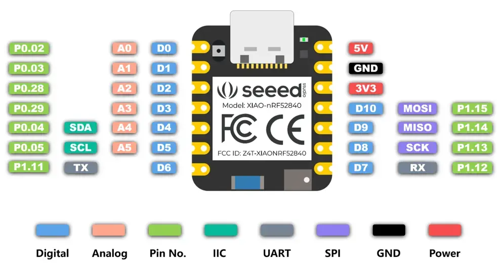
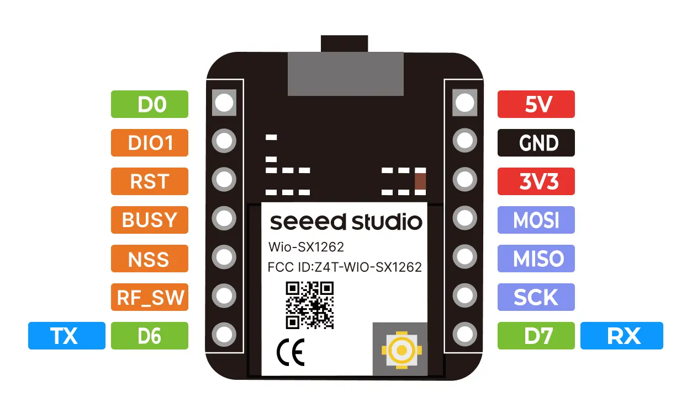

# Seeed Studio XIAO

## Models

* [XIAO SAMD21](https://wiki.seeedstudio.com/Seeeduino-XIAO/), XIAO nRF52840, and XIAO nRF52840 Sense
* XIAO RP2040, [XIAO RP2340](https://wiki.seeedstudio.com/getting-started-xiao-rp2350/)
* XIAO ESP32C3, XIAO ESP32S3

## Extension

* LoRa SX1262

## Pinout

## Getting started with Arduino

For Seeed Studio XIAO SAMD21, XIAO nRF52840, and XIAO nRF52840 Sense, copy the link address below: https://files.seeedstudio.com/arduino/package_seeeduino_boards_index.json

For Seeed Studio XIAO RP2040, copy the link address below: https://github.com/earlephilhower/arduino-pico/releases/download/global/package_rp2040_index.json

For Seeed Studio XIAO ESP32C3, XIAO ESP32S3, copy the link address below: https://raw.githubusercontent.com/espressif/arduino-esp32/gh-pages/package_esp32_dev_index.json

## Getting started with RIOT OS

https://doc.riot-os.org/group__boards__seeeduino__xiao.html

https://doc.riot-os.org/group__boards__seeedstudio-xiao-nrf52840.html

https://doc.riot-os.org/group__boards__seeedstudio-xiao-nrf52840-sense.html

https://doc.riot-os.org/group__boards__rpi__pico.html

https://doc.riot-os.org/group__boards__esp32s3.html

## Getting started with Meshtastic

https://wiki.seeedstudio.com/xiao_nrf52840&_wio_SX1262_kit_for_meshtastic/

https://wiki.seeedstudio.com/xiao_esp32s3_&_wio_SX1262_kit_for_meshtastic/

## Getting started with TinyML and Edge Impulse

https://mjrovai.github.io/XIAO_Big_Power_Small_Board-ebook/chapter_4.html

https://docs.edgeimpulse.com/docs/edge-ai-hardware/mcu/seeed-xiao-nrf52840-sense

## Ressources

https://wiki.seeedstudio.com/Seeeduino-XIAO/#resourses

### Books

https://mjrovai.github.io/XIAO_Big_Power_Small_Board-ebook/

### PCB

* Kicad footprint https://www.seeedstudio.com/blog/2020/04/23/use-seeeduino-xiao-in-kicad-pcb-design-like-a-components/

