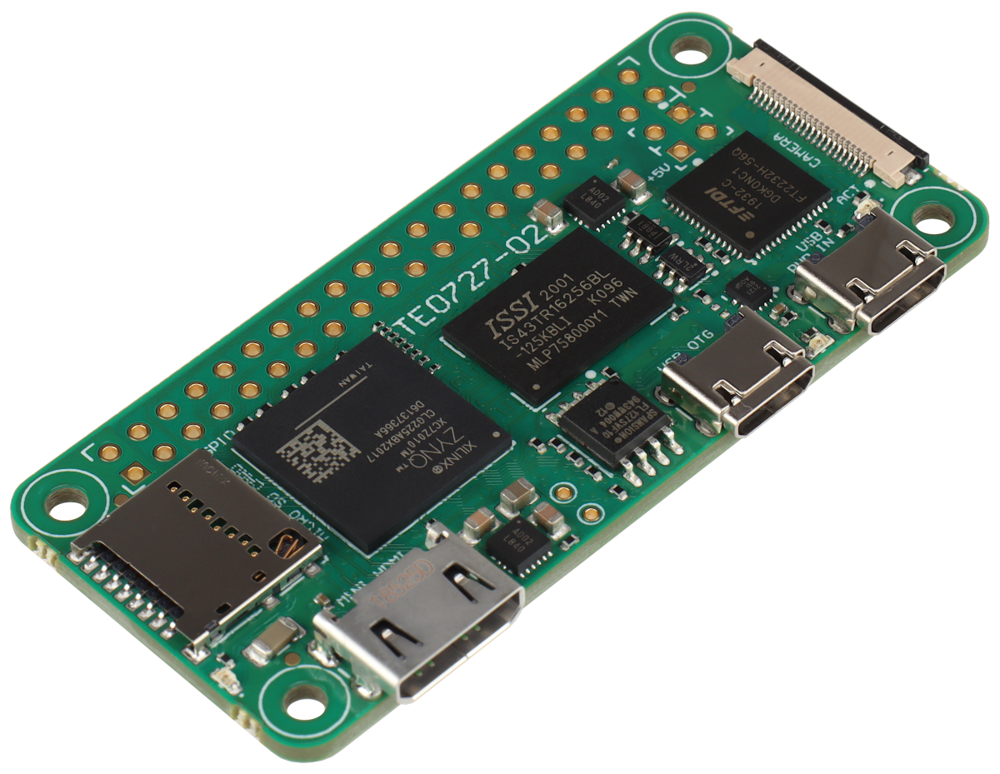

# Zynqberry Zero

La Zynqberry Zero est une carte de développement au format Raspberry Pi Zero qui embarque une puce SoC AMD Zynq™ 7010 (ex Xilink)  avec un processeur 2 coeurs ARM Cortex-A9 ainsi qu'une matrice FPGA pour le support à la conception de circuits logiques complexes.

https://adaptivesupport.amd.com/s/question/0D52E00007IPet1SAD/microzed-chronicles-zynq-berry-zero?language=en_US

* Zynq Z-7010 in a CLG225 Pin Package
* 512 MB of DDR3L (IS43TR16256BL125KBLI)
* 16 MB of QSPI Flash (S25FL127SABMFV10)
* MIPI Connector – 2 Lane MIPI CSI Support
* Mini HDMI
* HAT-Compatible 40-Pin Header
* SD Card Connector
* USB Power, UART and JTAG (FT232H) 
* USB OTG (USB3320C-EZK)

